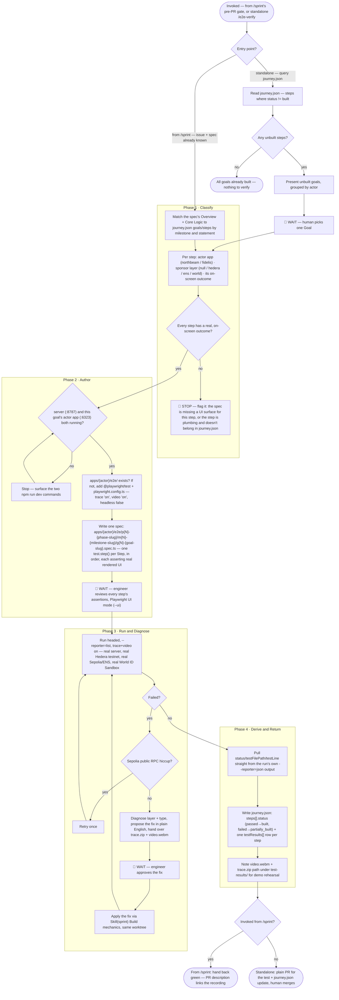

# /e2e-verify — Prove a Goal Works, In the App

**What:** Take a Goal from `tools/journey-tracker/public/journey.json` that isn't yet proven `built`, run it end to end against the real local stack — real server, real Hedera testnet, real Sepolia/ENS, real World ID Sandbox — close whatever gaps are found, and leave behind a real, re-runnable Playwright test whose own passing run is the only thing that ever sets `built`. Every Step's proof has to be something a person can watch happen on screen — never a bare API call, database read, or script.

**Why:** `journey.json`'s `status` is currently hand-edited (see `tools/journey-tracker/README.md`) — a claim, not proof, and nothing re-checks it. For this project the end deliverable is a live demo: a Step that's only provable by a script or a backend assertion is not demo-ready even if the underlying logic is correct, because nobody in the room can see it happen. This skill makes `journey.json` trustworthy by construction (status only ever comes from a real test run) and makes every proven Step something you can actually show — live, or replayed from a recording — because the whole point of proving it is being able to demo it.

**How:** Called two ways. Automatically — `/sprint` invokes this right before opening a PR, once an issue's implementation is green; the issue's spec and worktree are already known, so this skips straight to matching the spec against `journey.json`. Standalone — `/e2e-verify` typed directly, to re-verify or newly prove a Goal outside an active sprint; this starts by querying `journey.json` for goals not yet `built`. Either way: classify every Step (which actor app, which sponsor layer, and confirm it has a real on-screen outcome), confirm the local stack is running, write one Playwright test with one `test.step()` per Step, get the engineer to review its assertions, run it headed with trace and video both on, diagnose and fix any gap through `/sprint`'s Build mechanics, then pull `status` and `testResults` mechanically out of the real run's own reporter output — never typed by hand — and write them into `journey.json`. When called from `/sprint`, hand control back for the PR (which links the recording). When standalone, ship it as a plain PR.

## SOP



## Structured Output: E2E Verify

Print at the top of every response without exception:

```
▶ /e2e-verify · [phase name · step name]
  🎯 Goal:        [goal statement or "not yet matched"]
  🎭 Actor:       [northbeam | fidelis | "not yet classified"]
  🏷️ Sponsor:     [none | hedera | ens | world | "not yet classified"]
  🖥️ UI proof:    [confirmed on-screen | ⚠️ missing — flagged | "not yet classified"]
  🎫 Issue:       [TECH-N — title | "none — standalone re-verify"]
  📂 Worktree:    [none | tech-n-slug]
  📄 Test file:   [path or "not yet written"]
  Steps:         [S1 ⏳ | S2 ✅ | S3 ❌ | … — one per Step, in order]
  🎥 Recording:   [test-results/<path>/video.webm | "not yet run"]
  🔴 Failure:    [error · S<n> | logic problem · S<n> | none]
  🏁 Status:     [classifying | 🛑 awaiting UI-surface fix | authoring | 🛑 awaiting assertion review | running | 🛑 awaiting fix approval | fixing | deriving proof | returning to /sprint | done]
```

## Hard Rules

**Every Step's proof must be visible in the app — not just code**
A `test.step()` is only acceptable proof of a Step when it asserts against real rendered UI the engineer can watch happen — a claim status pill flipping, a toast or error banner appearing, a tx hash or ENS name rendering in a ledger table, a form's result showing on screen. A bare API/network assertion, a database read, or a backend script is never the terminal proof of a Step, even if it's a true and useful sanity check along the way — it can appear inside a `test.step()` only as a precondition-setup line, never as the step's own final assertion. If a Step genuinely has no on-screen outcome, stop at Phase 1's UI gate: either the spec is missing a UI surface for it, or the Step is plumbing and shouldn't be a Step in `journey.json` at all — resolve which, don't silently prove it with a script.

**Intent is a claim too**
A Goal's `statement` in `journey.json` is a claim, exactly like `status` is — never assumed correct just because a row exists. Any Goal that isn't already `built` and passing goes through `/sprint`'s necessity check before any building starts. A gap found mid-verify in a `built` Goal is a wrong claim about implementation — treat it as license to re-check whether the claim about intent still holds too, rather than patching code toward stale intent.

**All real work happens in a worktree, shipped through a PR — never on main**
This applies even to a pure-confirmation run on an already-`built` Goal where no product code changes: the new test file and the `journey.json` update are still real repo changes. The worktree and PR are never skippable, even when the Linear issue and spec are (standalone, no-code-change case only).

**No mocks — except a documented, dated, physical-device exception**
Run against the real server, real Hedera testnet, real Sepolia/ENS, and the real World ID Sandbox. The one legitimate exception is a step that needs a physical device World's own SDK requires (a real phone completing a live scan) — Playwright cannot drive that. When that's genuinely the case, follow the exact convention already in `apps/northbeam/e2e/selfie-check.spec.ts`: mock only that boundary, keep the assertion scoped to proving the frontend now calls the real backend (not a fake timer), and add a dated comment stating exactly what was confirmed by hand, on what device, with what credential preset. Mocking your own backend's response is never acceptable as a substitute for hitting it for real — this stack's Express routes, Hedera calls, and Sepolia/ENS calls are all fully automatable and must run for real.

**A Sepolia RPC hiccup is not a bug**
`SEPOLIA_RPC_URL` is a shared, rate-limited public endpoint (see `.env.example`). A failed Sepolia/ENS call gets one retry before it's treated as a real bug. There is no sibling contracts repo blocking a fix here — Hedera, Sepolia/ENS, and any future Solidity contracts (`contracts/`, per `.claude/skills/tests/references/contracts.md`) all live in this same repo, so a real bug at any layer, onchain code included, gets fixed the same way as any other layer: via `/sprint` Build mechanics, in the same worktree.

**Never fix before the engineer approves the diagnostic**
Surface the failure, name the type and layer, propose the fix in plain English, and stop. No file edits until the engineer explicitly says to proceed. Once approved, the fix is applied through `/sprint`'s Build mechanics — never a raw edit.

**Diagnostics must be plain English**
State what was expected, what actually happened, which layer, and what the fix is — one short paragraph, no stack traces or file paths as the lead.

**The engineer watches every stage, never just reads a summary**
Before the real run: Phase 2 review uses Playwright UI mode (`--ui`) to interactively step through the test. During the run: Phase 3 runs headed with `--reporter=list` so the browser and each step's pass/fail are visible live. After a failure: hand over both `npx playwright show-trace <path>` (DOM/network/console replay) and the recorded `video.webm` — a plain-English diagnosis summarizes what they show, never replaces them.

**After fixing, re-run the goal and everything related to it**
A fix in one layer can expose a gap in another — re-run the full goal test after every fix. Before calling a Goal proven, also run the actor app's full e2e suite and any `vitest` suites the fix touched (`server/npm test`, `apps/{actor}/npm test`) — a fix that breaks an existing test is not a fix.

**`status` and `testResults` are never hand-typed — only ever computed from a real run**
Passed → `built`. Failed → `partially_built`. No real test yet → `proposed`. Pull `testFilePath`, `testLine`, and `ranAt` straight from the real run's own reporter output and write them as a `testResults[]` row per step, matching the exact shape `JourneyBoard.tsx` already reads (`id`, `stepId`, `status`, `testFilePath`, `testLine`, `ranAt`). This supersedes `tools/journey-tracker/README.md`'s "edit `journey.json` by hand" instruction for any step this skill has verified — hand-editing stays valid only for steps that have never been run for real.

**Exactly one test file per Goal, one `test()` per file, one `test.step()` per Step, in order**
Never bundle two Goals into one `test()`, and never collapse a Step's proof into a bare assertion outside a named `test.step()` — the step-level line is what `testResults[].testLine` points to. A Step that only makes sense after a different actor's real decision (e.g. Fidelis reviewing a claim Northbeam already filed) seeds that precondition via a direct backend call rather than replaying the earlier Goal's own UI — but the Step under test still has to end on screen.

**A Goal's test file lives at a fixed path**
`apps/{actor}/e2e/p{phase.order}-{phase.slug}/m{milestone.order}-{milestone.slug}/g{goal.order}-{goal.slug}.spec.ts`, every level named and numbered straight from `journey.json`:

```
apps/northbeam/e2e/
└── p1-provision-operate/
    └── m1-set-up-spending-rules/
        └── g1-ap-controller-locks-rules.spec.ts
```

**Every goal-verification run captures both trace and video**
`playwright.config.ts` for every actor app sets `trace: 'on'`, `video: 'on'`, and `headless: false` — a passing result with no trace and no recording on file is not acceptable proof, and isn't usable for the demo either.

## References

| Description | File |
|---|---|
| `journey.json` schema (goals/steps/testResults/sponsor) | `tools/journey-tracker/src/types.ts`, `tools/journey-tracker/public/journey.json` |
| The one existing precedent for a documented mock exception | `apps/northbeam/e2e/selfie-check.spec.ts` |
| Existing trace-on Playwright config to copy for a new actor app | `apps/northbeam/playwright.config.ts` |
