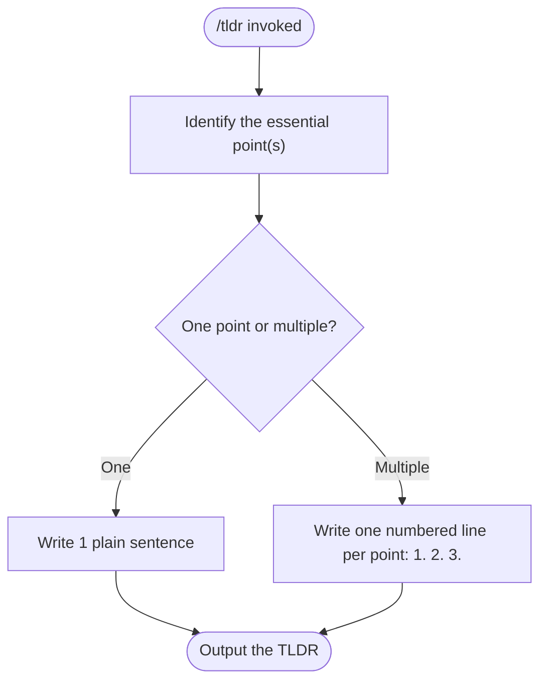

# /tldr — Compress to the Essence

**What:** Take whatever is currently being discussed — a question, a topic, or a long answer already given — and state its essence in a few short sentences, cutting fluff, hedging, and over-explanation.

**Why:** AI answers default to long, hedged, over-structured explanations even when the human only wants the core point; making the human ask for brevity every time wastes their attention on filtering signal from noise.

**How:** Look at whatever is already in the conversation — the question just asked, the topic under discussion, or a response already given — no other setup is needed. Identify the essential point(s). If there is one point, write it as a single plain sentence. If there are multiple distinct points, list them one per line as `1.` `2.` `3.` etc.

## SOP



## Structured Output: TLDR

Print at the top of every response without exception:

```
▶ /tldr
  Source:   [question | topic | prior answer]
  Status:   done
```

## Hard Rules

**Never use headers, bullets, or the Reasoning/Decision/Action Items structure**
- **What:** Output plain prose (one point) or a numbered list (multiple points) only — no `##` headings, no `**Reasoning**`/`## Decision` blocks, no task lists, no `-` bullets.
- **Why:** The point of a TLDR is to remove structure that makes the reader parse formatting instead of reading the answer. This overrides the global CLAUDE.md response-structure rule for this skill's output.
- **How:** Even for a substantive question, the only structure allowed is a plain sentence or a flat `1. 2. 3.` list — no section labels, no sub-bullets.

**One point per line**
- **What:** If the TLDR has exactly one essential point, write it as a single plain sentence, not a list. If it has two or more distinct points, write each as its own numbered line: `1.` `2.` `3.` etc.
- **Why:** Cramming multiple distinct points into one run-on sentence hides them from a reader scanning for the answer; forcing a single point into a list adds structure it doesn't need.
- **How:** Count the distinct points before writing. One point → prose. Two or more → numbered lines, one point per line, each line a short plain sentence.

**One sentence is the default, not the ceiling**
- **What:** If the essence genuinely fits in one sentence, stop at one sentence. Do not add a second sentence of context, a supporting example, or a "to elaborate" follow-up just to seem thorough.
- **Why:** A one-sentence answer padded into a paragraph defeats the entire point of TLDR — the reader asked for the compressed version specifically to avoid reading extra words.
- **How:** After drafting, ask: does removing every sentence after the first lose any of the essential point? If no, delete everything after the first sentence.

**Never hedge or restate the question**
- **What:** Do not open with "It depends" or stack multiple caveats; do not repeat the question back before answering it.
- **Why:** Hedging and restating are exactly the padding this skill exists to remove.
- **How:** State the essence directly as the first words (or first numbered line) of the response.

**Hard cap: 5 points, 1 sentence each**
- **What:** Never produce more than 5 numbered points, and never more than 1 sentence per point (or per single-point prose answer).
- **Why:** A cap that can be exceeded isn't a cap — without one, "concise" drifts back to paragraph-length over time.
- **How:** If the essence doesn't fit within 5 points, cut the least essential points, not the sentence limit per point.
