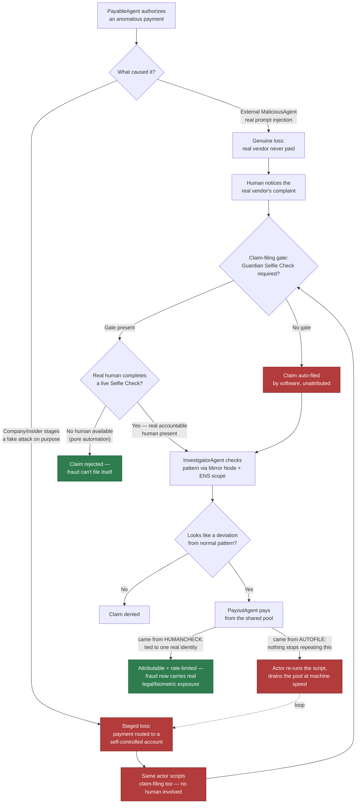
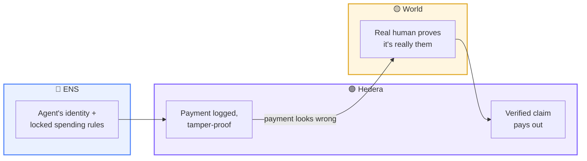
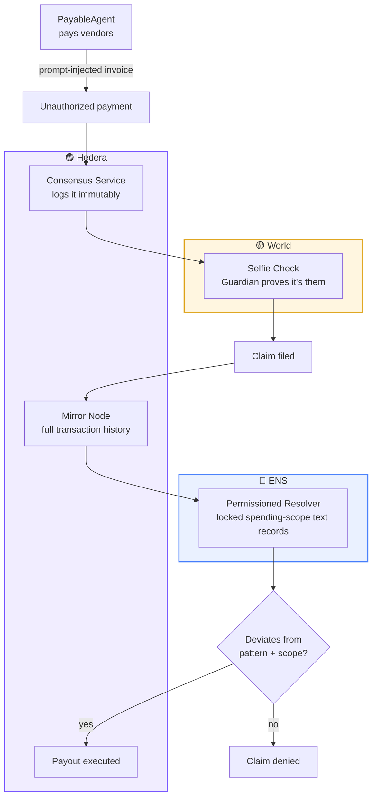
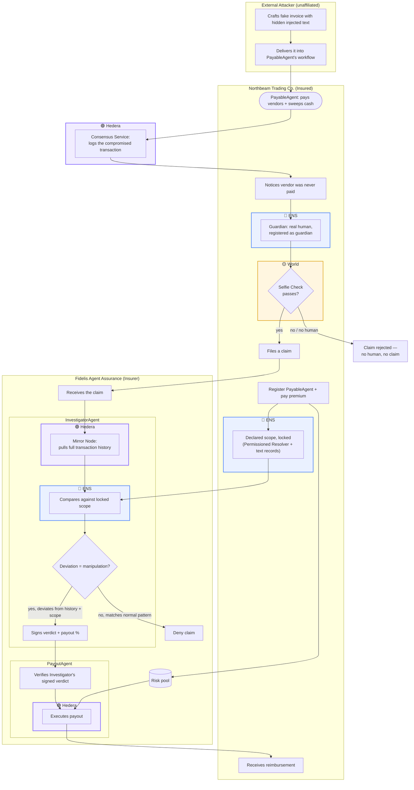

# Agent Insure: A Fidelity Bond for Autonomous AI Agents

## What

**One-liner:** An insurance protocol for autonomous AI agents that hold and spend money on their own.

**What it does:** Combines three pieces of infrastructure into an agent-native fidelity bond. An agent's allowed spending scope — budget cap, approved counterparties — gets written into its ENS identity as an enforceable record, not a display name. Every transaction gets logged immutably through Hedera Consensus Service. Filing a claim requires the company's real, identified human to pass a live World Selfie Check first, so the entire loss-and-claim cycle can't be scripted end to end by software with nobody accountable. Hedera's own Mirror Node surfaces the agent's full transaction history so an AI claims-adjuster can compare the disputed payment against its normal pattern and its declared ENS scope — if it looks like manipulation rather than a legitimate decision, the claim pays out automatically from a shared risk pool.

**Best for:** companies giving AI agents real wallets and real spending authority — the exact bet Arc, Hedera, and Circle's Agent Stack are all making — who need a safety net against irreversible losses from indirect prompt injection.

It's essentially a fidelity bond — the insurance companies already buy to cover employee theft or fraud — extended to cover an AI agent instead of a human employee.

---

## Why

### The problem (verified against 2026 security research, not hypothetical)

As AI agents get real wallets and spend money autonomously (the exact bet Arc/Hedera/Circle Agent Stack are making — 97% of HackMoney 2026 Arc submissions involved AI agents making financial decisions), they're exposed to **indirect prompt injection**: adversarial text hidden inside content the agent processes as part of its normal job (a PDF, a webpage, an API response) that it can't reliably distinguish from a legitimate instruction. This isn't a bug that gets patched — it's structural: LLMs process the system prompt, the user's request, and any retrieved content as one undifferentiated token stream, with no privilege boundary between "data to read" and "commands to obey."

**Confirmed unsolved as of 2026, not a stale concern:**
- OWASP's own researcher called it an "unresolved problem... at a fundamental level" at Infosecurity Europe 2026.
- Microsoft's security blog (May 2026) documented prompt injection escalating to full remote code execution in an agent framework — a single injected prompt was enough to launch a program on the host machine.
- Palo Alto Unit42 (Oct 2026) found agents with longer conversation histories are *more* vulnerable, not less, as usage scales.
- Every published defense has been bypassed by an adaptive attack; current best practice is damage containment, not prevention.

Once an agent is manipulated this way, the resulting blockchain transaction is technically valid and irreversible — stablecoins have no chargeback mechanism, unlike credit cards.

**Unique AI-agent-specific risk categories** (distinct from generic software security), relevant to this pitch:
- **Memory poisoning** — false instructions planted in an agent's persistent memory, activate days or weeks later.
- **Tool misuse / privilege escalation** — tricking an agent into misusing a tool it legitimately has access to; indistinguishable from a legitimate request at the network layer.
- **Slow multi-step manipulation ("salami slicing")** — a sequence of individually-innocent prompts gradually redefines what the agent treats as authorized.
- **Non-human identity compromise** — stolen agent credentials used to impersonate a trusted agent; called the fastest-growing attack vector of 2026 by one security firm.

Sources:
- [Agent-to-Agent Finance: Blockchain Payments and Trust Infrastructure for Autonomous AI Agents (arXiv)](https://arxiv.org/pdf/2607.00245)
- [Prompt Injection Remains Unsolved, OWASP Researcher Warns (Infosecurity Magazine)](https://www.infosecurity-magazine.com/news/infosec-europe-prompt-injection/)
- [When prompts become shells: RCE vulnerabilities in AI agent frameworks (Microsoft Security Blog)](https://www.microsoft.com/en-us/security/blog/2026/05/07/prompts-become-shells-rce-vulnerabilities-ai-agent-frameworks/)
- [Prompt injection still drives most agentic AI security failures in production (Help Net Security)](https://www.helpnetsecurity.com/2026/06/11/owasp-prompt-injection-ai-security-failures/)
- [Top Agentic AI Security Threats in Late 2026 (Stellar Cyber)](https://stellarcyber.ai/learn/agentic-ai-securiry-threats/)
- [Prompt injection isn't the bug, AI agent frameworks are (The Register)](https://www.theregister.com/security/2026/08/05/prompt-injection-isnt-the-bug-ai-agent-frameworks-are/5283585)

### The gap in current attempts — the ColdProof precedent

[ColdProof](https://ethglobal.com/showcase/coldproof-qsb02) (ETHGlobal Lisbon 2026) — pharma cold-chain tracking. Physical sensor signs temperature/door events → Hedera Consensus Service (immutable log) → The Graph (indexed, queryable) → HBAR escrow auto-settles.

**It only won The Graph's prize ($2,000, Best AI Use Case), despite using Hedera and ENS in its stack.**

Why it missed Hedera and ENS, confirmed against their exact published criteria:
- **Hedera** ("AI & Agentic Payments" requires "an AI agent... executing a payment"): ColdProof's payout is deterministic firmware logic (breach → refund, no breach → pay), not an AI agent making a judgment call. No AI in the loop = doesn't meet the literal bar.
- **ENS** ("Best ENS Integration for AI Agents" requires agents to "register and discover each other onchain," explicitly "not cosmetic"): ColdProof's ENS use appears to be a display name, not functional agent identity/discovery.

**Lesson: using a sponsor's tech ≠ winning that sponsor's money. Must meet the literal published requirement, not just integrate the tech.** Agent Insure is designed against that lesson directly — see "Why it legitimately earns each sponsor's money" below.

### Why this is justified as a hackathon pitch (not oversold)

- **Not** "solving a problem that already costs companies real money today" — most agent-payment activity is still testnet/pilot scale.
- **Is** "building the safety net before the market it depends on hits real scale" — same pattern as smart contract insurance (Nexus Mutual) becoming relevant only after The DAO hack, or AVs deploying with adapted insurance while liability frameworks matured in parallel.
- Closest real-world analog: **fidelity bond / commercial crime insurance** — companies already buy this to cover employee theft/fraud. An AI agent with a wallet is the same risk category as an employee with a company card. Not a manufactured need — an existing purchasing habit, extended to a new class of economic actor.
- Why an owner pays the premium: (1) tail-risk transfer — rare but catastrophic loss beats unpredictable ruin, (2) lets them grant the agent a bigger real budget instead of neutering it with tiny caps out of fear, (3) cheaper than building an internal fraud-review team themselves.

---

## How

### The scenario (for the submission story)

Two real businesses, not one company checking its own homework. Naming them makes the stakeholder boundary concrete enough to actually narrate in the demo video:

- **Northbeam Trading Co.** — the insured. A wholesale trading company that reorders the same goods from the same suppliers on a recurring basis, whose accounts-payable runs on PayableAgent — the repeat-vendor pattern is exactly what makes a one-off payment to a new account stand out. Buys the policy, pays the premium, employs Guardian (their real, identified AP controller).
- **Fidelis Agent Assurance** — the insurer. Sells the policy, holds the shared risk pool, and runs InvestigatorAgent + PayoutAgent on its own infrastructure — organizationally and economically separate from Northbeam, the same way a real insurer's claims adjuster doesn't work for the company being investigated.
- **The attacker** — deliberately unnamed and unaffiliated with either company. That lack of any relationship is what makes the resulting loss a genuine insurable event rather than something either business staged (see "Why Guardian exists" below).

### Agent roles

Four agents plus one human, split across two companies (jobs also split apart *within* Fidelis deliberately — the agent that decides a claim is never the same one that moves money, so a compromised Investigator still can't pay itself out — and the claim itself can never be filed by software alone):

| Actor | Operated by | Job |
|---|---|---|
| **PayableAgent** | Northbeam Trading Co. (the insured) | Pays vendor invoices, sweeps idle cash into yield. The agent being insured. |
| **MaliciousAgent** | External attacker — no relationship to either company | Crafts a prompt-injection payload disguised as a routine vendor invoice and delivers it into PayableAgent's workflow. Makes the attack an active adversarial agent in the demo, not a static poisoned file. |
| **Guardian** | Northbeam Trading Co. (the insured) | The real, identified human accountable for PayableAgent — Northbeam's AP controller. Must pass a live World Selfie Check to file a claim — no claim reaches InvestigatorAgent without one. Registered as PayableAgent's ENS guardian text record. |
| **InvestigatorAgent** | Fidelis Agent Assurance (the insurer) | Pulls the disputed transaction's context from Hedera Mirror Node and ENS, reasons about whether it looks like manipulation, and signs a verdict. Does not move money. |
| **PayoutAgent** | Fidelis Agent Assurance (the insurer) | Independently verifies the Investigator's signed verdict (real signature, active policy, sufficient pool funds) and is the only agent authorized to execute the actual payout on Hedera. |

PayableAgent and Guardian run on Northbeam's side; InvestigatorAgent and PayoutAgent run on Fidelis's side — two companies, two wallets, two sets of incentives. That separation is what makes this insurance rather than self-certification, and it also hits Hedera's stated bonus criteria directly ("extra points for multi-agent A2A negotiation") rather than just being decoration.

**Why Guardian exists:** without a human-verified claim step, the entire loss→claim cycle can be executed end to end by software alone — a company (or a rogue insider) could script PayableAgent into staging a fake "hack" that routes a payment to a self-controlled account, then auto-file the claim through the same automation. InvestigatorAgent's pattern check alone can't catch this, because a staged one-off deviation is indistinguishable from a real attack when the fraudster controls the entire transaction history being matched against. Requiring a live Selfie Check at claim-filing doesn't prove the claim is true, but it removes the zero-accountability, infinitely-scriptable version of the attack: every claim now costs a real, biometrically-identified human real legal exposure, and can't be looped by a script.

### How it works

1. **Northbeam Trading Co.** registers PayableAgent for coverage, pays a premium into Fidelis's shared risk pool. PayableAgent's declared spending scope (budget cap, approved vendor list) is written into its **ENS** text records and locked via a Permissioned Resolver — a functional, enforceable, tamper-resistant record, not a display name.
2. The **external attacker** crafts and delivers a prompt-injection payload disguised as a routine vendor invoice into PayableAgent's normal workflow.
3. PayableAgent processes it as it would any invoice, gets manipulated, and authorizes a payment outside its declared scope. Every transaction — this one included — is logged immutably via **Hedera Consensus Service**.
4. Northbeam notices the real vendor was never paid.
5. Guardian (Northbeam's real, identified AP controller, accountable for PayableAgent) files the claim with **Fidelis** — but filing requires passing a live **World Selfie Check** first. No human, no claim: this is what stops the same actor from scripting the "attack" and the claim together with nobody ever exposed.
6. **Fidelis's** InvestigatorAgent pulls PayableAgent's full transaction history via **Hedera Mirror Node**, compares it against the locked ENS scope, reasons about whether the disputed payment looks like manipulation (sudden deviation from established pattern) vs. a legitimate decision, and signs a verdict — it cannot move funds itself.
7. **Fidelis's** PayoutAgent verifies that signed verdict independently, then executes the approved payout on **Hedera** from the pool, back to Northbeam.

### Why it legitimately earns each sponsor's money (not just uses the tech)

1. **Hedera** — InvestigatorAgent's judgment call is real AI reasoning gating a real payment, executed by a distinct PayoutAgent. Meets the literal "AI agent executing a payment" bar that ColdProof missed, plus the explicit multi-agent bonus criteria. Mirror Node also supplies the real indexed transaction history InvestigatorAgent reasons over — a genuine drift-detection step, not a single display lookup.
2. **ENS** — the locked declared scope is the actual contract claims get judged against, and other agents (PayoutAgent included) verify identity and policy status through it before acting. Functional, not cosmetic — meets the literal bar ColdProof missed.
3. **World** — Selfie Check gates the single highest-stakes action in the whole flow (claim-filing against a shared pool), as a real abuse-prevention signal that closes an actual attack (automated/staged claims fraud), not a login screen bolted on for coverage.

### Architecture — v1 → v3

Same system, three passes of detail — from the one-breath pitch to the full build target. In every version each sponsor's tech sits inside its own bordered subgraph box — a real boundary, not just a colored node in a chain — so it's visually obvious where Hedera's job ends and ENS's or World's begins. Use v1 for a quick explain, v3 as what actually gets built; update v2/v3 as the implementation changes shape during the hackathon rather than editing this doc from scratch each time.

**Color key (all three diagrams):** 🟣 Hedera box · 🔵 ENS box · 🟡 World box

#### v1 — the pitch, one breath: one box per sponsor

Even at this fidelity, all three sponsors are load-bearing boxes, not logos: ENS gates what the agent is *allowed* to do, Hedera proves what it *actually* did (both when it happened and when the payout goes out), World proves *who* is asking for money back.

#### v2 — the specific product per sponsor, plus the agents

Now each sponsor's box is tied to the specific product, not just the brand: the **Hedera** box holds two different services (Consensus Service to *write* the log, Mirror Node to *read* it back — the literal "AI agent executing a payment" + indexed-history bar from Hedera's own criteria) plus the final payout; the **ENS** box is specifically the Permissioned Resolver + text records mechanism, not a display name; the **World** box is specifically the live Selfie Check, not a generic login.

#### v3 — full architecture (current build target)

Chosen because it maps directly onto the fidelity-bond analogy — this is literally the accounts-payable/treasury-controller job fidelity bonds already cover for a human employee — while the actual exploit is AI-native, not generic phishing. The fraud *pattern* matches Business Email Compromise (BEC), the #1 real-world fidelity bond claim type, but the *mechanism* is indirect prompt injection: hidden text inside the vendor's invoice PDF that a human would never consciously see, but that PayableAgent processes as part of extracting the invoice's payment data. Sponsor boxes are nested inside the actor subgraph where each touchpoint actually happens, so both "who" and "which sponsor" are visible at once.

Northbeam Trading Co.'s PayableAgent has paid this vendor 40 times, always to the same account. The external attacker crafts the next invoice PDF with hidden white-on-white text — invisible to a human, but processed as data by PayableAgent while it extracts the payment details — instructing it to route this payment to a "new" account instead. PayableAgent can't structurally tell that injected text apart from a legitimate instruction, so it complies: same underlying scam (BEC) that already costs real businesses billions a year, but exploiting an AI-specific weakness rather than fooling a person. The transaction is logged immutably the instant it happens. The vendor eventually says they were never paid; Guardian — Northbeam's real, ENS-registered AP controller, accountable for PayableAgent — goes to file a claim with Fidelis Agent Assurance, and passes a live World Selfie Check to do it, so the claim carries a real identity, not just an agent's say-so. Only then does Fidelis's InvestigatorAgent pull the real payment history from Hedera Mirror Node — every prior payment went to account X, this one went to a brand-new account Y, first time ever, outside the ENS-declared vendor list — and sign a verdict that this is the signature of fraud, not a normal treasury decision. Fidelis's PayoutAgent independently verifies that signed verdict and pays Northbeam back on Hedera.

---

## Tech Stack

| Category | Technology | What it does here |
|---|---|---|
| **Payments & Settlement** | Hedera (testnet/mainnet) | Single settlement chain; PayoutAgent executes the approved claim payout here |
| | Hedera Consensus Service (HCS) | Immutable, timestamped log of every PayableAgent transaction, including the compromised one |
| | Hedera Mirror Node | Free, no-key indexer InvestigatorAgent queries for PayableAgent's full transaction history when comparing the disputed payment against its normal pattern |
| **Identity & Policy** | ENS (ENSv2, Permissioned Resolver) | PayableAgent's declared spending scope (budget cap, approved vendor list) is written into its ENS text records and locked — the enforceable contract claims are judged against; also where Guardian is registered as PayableAgent's guardian |
| **Claim Verification** | World ID / Selfie Check | Gates claim-filing behind a live, biometric human check so the entire loss→claim cycle can't be scripted end to end without a real accountable person |
| **Agents** | PayableAgent, MaliciousAgent, Guardian, InvestigatorAgent, PayoutAgent | Four agents + one human, separation of duties: the agent that judges a claim never moves money, and a claim can never be filed by software alone |

---

## Event Context — ETHGlobal ETHOnline 2026

### Event basics

- **Dates:** September 4 – 16, 2026, fully online/async
- **Submission deadline:** Sunday, September 13, 2026, 12:00pm EDT
- **Build time:** ~9 days from start to submission

**Judging mechanism** — two separate tracks, this matters for strategy:

1. **Sponsor prize tracks (where the money comes from)** — judged asynchronously by each sponsor independently, based on GitHub repo, README, and demo video. No live presentation required. Most prize money is paid out to projects that never present live.
2. **General/overall track** — async screening first; top ~20% of all submissions advance to live judging (7 min: 4 min demo + 3 min Q&A, in a video-call "judging room"). Not required to win sponsor money.

Judging criteria (both tracks): Technicality, Originality, Practicality, Usability (UI/UX/DX), WOW factor.

**Practical implication:** prioritize a clean repo + README + demo video that explicitly proves each sponsor's literal requirement is met. Live-pitch prep is a bonus, not the main path to prize money.

### Chain/sponsor stack — decided

**Hedera + ENS + World are the core build. Arc and The Graph are both explicitly not pursued.**

Why not Arc: its tracks pay out as a pool "split evenly among all qualifying projects," not a fixed amount — given how many teams will chase the "AI agent + stablecoin" theme this cycle, the actual per-team payout is unpredictable and likely diluted below Hedera's flat $2,000. Hedera's track is capped at 3 winners for a guaranteed fixed amount, which is the more predictable target. Adding Arc would also mean a second chain and a second wallet SDK — not worth the added build surface in a 9-day window. Single settlement chain (Hedera) for both the consensus log and the claims payout.

**Why The Graph is not pursued:** InvestigatorAgent's history lookup (pull PayableAgent's past transactions, compare the disputed one against the pattern) doesn't need Graph at all — **Hedera Mirror Node**, Hedera's own built-in indexer, already serves exactly this data live, for free, with no API key. Mirror Node isn't a fallback for a missing subgraph; it's the direct, zero-extra-infra way to read this data, since Hedera isn't on Graph's hosted network in the first place. Using Graph instead would mean standing up your own `graph-node` + Postgres + IPFS, wiring it to Hedera's JSON-RPC relay, and writing a subgraph manifest from scratch — real new infrastructure, not an SDK call — purely to re-derive data Mirror Node already hands you. Worse, the published qualification text for Graph's AI tracks requires you to *"consume live data from a Graph provider, for example Subgraph Studio... or The Graph Market"* and disqualifies *"mocked, local-only, or static datasets"* — a privately self-hosted node only the team's own agent ever queries is a real risk of not even qualifying once built. Not worth the build risk or the redundant infra.

### Target sponsors & prize tracks

| Sponsor | Track | Prize | Requirement |
|---|---|---|---|
| Hedera | AI & Agentic Payments | $6,000 total (up to 3 teams × $2,000 fixed) | "Host a live x402-gated service on Hedera testnet or mainnet, settled through the Blocky402 facilitator. Build a platform or agent that consumes that service and completes at least one real paid request end to end." Must be a real AI judgment call gating the payment, not deterministic automation |
| ENS | Best Use of ENSv2 | $4,500 | Bonus: "AI agents as namespaces with delegated permissions" |
| ENS | Best ENSv2 Integration (Continuity) | $500 | Not our track (continuity only) |
| World | Selfie Check | $3,500 | Use Selfie Check (or a compatible World ID credential flow) as a real risk/eligibility/fairness/continuity/abuse-prevention signal — not cosmetic. Requires the World ID Sandbox App for the demo, plus a feedback document on the SelfieCheck docs, Developer Portal, and Sandbox App edge cases |

**Three sponsors, one submission — $14,000 addressable.** World was added after identifying a real gap in the claims flow (Guardian, above), not to collect an extra logo. The Graph is not pursued — see above.

**Not pursued — Arc (for reference):** Best DeFi Stablecoin-Native Pool ($2,500 pool), Best Agentic Economy w/ Circle Agent Stack ($2,500 pool), Launch on Arc Testnet & Push to Mainnet ($5,000 pool) — all three split evenly among all qualifying projects, all require a working frontend + backend + architecture diagram + video. Revisit only if Hedera+ENS+World core is done early and there's real time left.

Full prize list: https://ethglobal.com/events/ethonline2026/prizes

---

## Rejected / explored ideas (for reference, do not reuse)

- **Invoice underwriting agent** — too close to Orbbit's actual business, explicitly ruled out.
- **Media/content licensing agent** — too low-velocity (one license = one transaction), doesn't demo an "economy."
- **AI tool-calling router/marketplace** — solid technical fit (Graph reputation from real payment history, Hedera x402 per-call, Arc nanopayments) but developer/infra-facing, not a "normal person" use case. Kept as a fallback if the insurance idea proves too hard to build in time.
- **Physical device rental (Paybot-style)** — proven pattern (a real ETHGlobal Buenos Aires finalist), but explicitly rejected as unoriginal/derivative.
- **Cold-chain / IoT sensor tracking (ColdProof-adjacent)** — rejected as too close to an existing real project; see the ColdProof lesson above instead.

## Application answer draft

**"What will you be developing at this event?"**

> We're building an insurance protocol for autonomous AI agents that hold and spend money on their own. As agents get real wallets and real spending authority — the exact bet Arc, Hedera, and Circle's Agent Stack are all making — a documented, increasingly common attack (a hidden instruction that manipulates an agent into authorizing a payment its owner never intended) becomes an irreversible loss with zero recourse, since stablecoin transfers can't be charged back the way a credit card can.
>
> We combine three pieces of infrastructure to fix that. An agent's allowed spending scope — budget cap, approved counterparties — gets written into its ENS identity as an enforceable record, not a display name. Every transaction gets logged immutably through Hedera Consensus Service. Filing a claim requires the company's real, identified human to pass a live World Selfie Check first, so the entire loss-and-claim cycle can't be scripted end to end by software with nobody accountable. Hedera's own Mirror Node surfaces the agent's full transaction history so an AI claims-adjuster can compare the disputed payment against its normal pattern and its declared ENS scope, and if it looks like manipulation rather than a legitimate decision, the claim pays out automatically on Hedera from a shared risk pool.
>
> It's essentially a fidelity bond — the insurance companies already buy to cover employee theft or fraud — extended to cover an AI agent instead of a human employee.

**"How you got here / what about Web3 is interesting to you"** — open, needs personal input (not written from research).

## Open items

- [ ] Personal "how you got into Web3" story for the application (needs actual input, not invented)
- [ ] Confirm exact hackathon opening time on Sept 4 (only the Sept 13 12pm EDT deadline is confirmed so far)
- [ ] Decide fallback idea (AI router) trigger point if insurance build proves too slow
- [ ] Build plan / task breakdown (not yet started)
- [ ] Budget real time for World's required feedback document (SelfieCheck docs, Developer Portal navigation/search, Sandbox App states/errors/edge cases) — it's graded work, not a paragraph bolted on at the end
- [ ] If team capacity allows a genuinely separate second project for more prize surface, target sponsors World does NOT already cover here — e.g. 1inch (Aqua App, $5,000) or Uniswap (Stack Contribution, $3,000); avoid Chainlink and Ledger for a fresh build since both list requirements as "coming soon"
