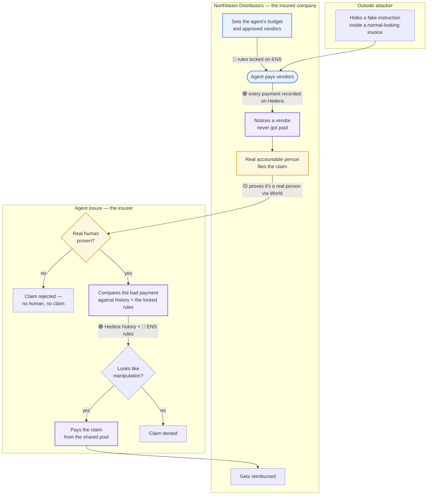
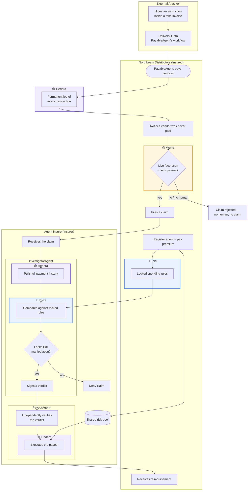

# Agent Insure

## 1. What this is

Insurance for AI agents that spend money on their own — if one gets tricked into making a bad payment, the loss gets paid back automatically.

## 2. Why this needs to exist

Companies are starting to let AI agents hold wallets and pay invoices without a human clicking "approve" every time. That's a real productivity win, but automating the work doesn't remove the risk of something going wrong — it just moves the risk onto a system nobody can fully audit in real time.

This is the same lesson every other autonomous-system industry already learned: a self-driving car still needs liability insurance even though no human is holding the wheel — the car making the decision doesn't mean nobody's on the hook when it makes the wrong one. An AI agent holding a company's money is the same shape of problem: someone still needs to be covered when the agent gets it wrong.

## 3. Why this specific risk is real, not hypothetical

AI agents read text to decide what to do — an invoice, an email, a webpage. The problem is they can't reliably tell the difference between "content to read" and "instructions to follow." Both just look like text to them.

That means an attacker can hide an instruction inside something totally normal-looking, like a vendor invoice PDF, in text a human would never notice. When the agent reads the invoice to pull out the payment amount, it also reads the hidden instruction — and follows it. This is called **prompt injection**, and as of 2026 it's a confirmed, unsolved problem: security researchers at OWASP, Microsoft, and Palo Alto have all found real attacks like this, and nobody has a permanent fix. Once the agent sends a payment, it's gone — there's no "chargeback" button for a crypto transaction the way there is for a credit card.

## 4. Our solution — how it works

We combine three pieces of infrastructure, one from each of our sponsors, into a single safety net:

| Sponsor | What it gives us in plain terms |
|---|---|
| 🔵 **ENS** | A locked, tamper-proof record of exactly what the agent is allowed to do — its budget and its approved vendors — so there's a clear rule to check every payment against. |
| 🟣 **Hedera** | A permanent, timestamped receipt of every payment the agent makes, plus a free public history log an investigator can pull up instantly instead of interviewing anyone. |
| 🟡 **World** | A live face-scan check that proves a real, accountable human — not a script — is the one filing the claim. |

Putting them together:

1. A company sets its agent's spending rules once, locked onto ENS.
2. The agent pays vendors normally — every payment gets a permanent receipt on Hedera.
3. An attacker sneaks a hidden instruction into an invoice, and the agent gets tricked into paying the wrong account.
4. The company notices the real vendor never got paid, and a real, identified human has to pass a live face scan (World) before a claim can even be filed — so nobody can script the entire scam-and-claim cycle end to end.
5. An AI investigator agent compares the bad payment against the agent's normal history (Hedera) and its locked rules (ENS) — if it looks like manipulation rather than a legitimate call, the claim pays out automatically from a shared pool.

It's the same insurance companies already buy for employee theft or fraud — just extended to cover an AI employee instead of a human one.



## 5. Demo video

_Pending — link goes here once the demo is recorded and uploaded._

## 6. Architecture diagram



Four agents plus one real human, split across two companies: **PayableAgent** (pays vendors, Northbeam's side) can get tricked by the **outside attacker**; **Guardian** (the real, identified human) must pass a live World face scan before a claim can be filed; **InvestigatorAgent** (Agent Insure's side) checks the claim against Hedera + ENS but never touches money; **PayoutAgent** independently double-checks the verdict and is the only one allowed to pay out. No single agent can both decide a claim and pay it.

## 7. Running the project

Three services run separately, each in its own terminal:

```bash
# 1. Backend API (Hedera, ENS, World integrations)
cd server && npm install && npm run dev

# 2. Northbeam Distributors portal — the insured company's app (localhost:6323)
cd apps/business && npm install && npm run dev

# 3. Agent Insure HQ — the insurer's app (localhost:6324)
cd apps/hq && npm install && npm run dev
```

Before running the backend, copy `.env.example` to `.env.local` and fill in the Hedera/ENS/World credentials — see `references/prereq.md` for how to get each one.

Run the end-to-end test suite (Playwright, drives both apps against the real backend, no mocks):

```bash
npm install
npx playwright install   # first time only
npm run test:e2e
```
