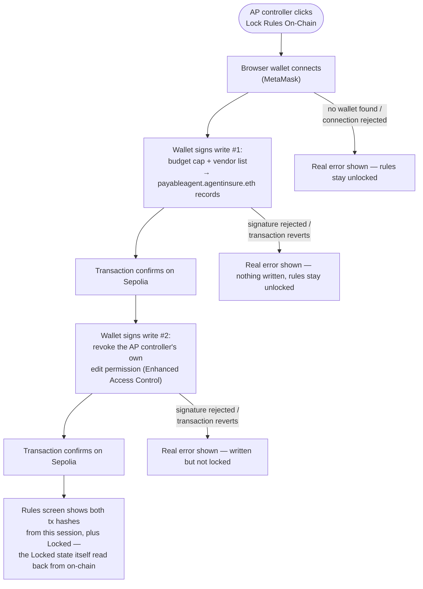

# Write PayableAgent's spending rules to real ENS text records

## Overview

**What:**
When Northbeam's AP controller locks PayableAgent's spending rules, the budget cap and vendor list become a real, permanent, publicly-readable record — not a flag that only exists in the AP controller's own browser tab.

**Why:**
Today, clicking "Lock Rules On-Chain" changes nothing outside the tab it was clicked in. There is no actual spending-scope contract for a disputed payment to be judged against later, no independent record an insurer or auditor can check for themselves, and no real guarantee the rules weren't quietly changed after the fact.

**How:**
The AP controller's own crypto wallet signs the write, live, in front of them — publishing the budget cap and vendor list to a real record anyone can look up — and then signs a second action that permanently locks that record, so it can never be changed again by anyone, including the AP controller themselves.

**Zone 1 check:**
Implementation. This moves the spending-rules lock from a Design-stage mock (a local flag flipped in one browser, silently reversible, invisible to anyone else) to a real, independently-verifiable public record that any outside party — the insurer, an auditor, a judge of the disputed claim — can check for themselves without taking Northbeam's word for it.

---

## Core Logic



### Business rules

- The Rules screen only shows "Locked" after reading the lock state back from the actual on-chain record — never from the button click alone. Transaction hashes, by contrast, aren't on-chain state (they're history, not a value the resolver stores) — they're only ever shown for the session that performed the write/lock, not re-derived on a later visit.
- Locking is two separate signed transactions, write then lock. A failure between them leaves a real, distinct, visible "written but not locked" state on screen — it is never silently treated as either fully locked or fully unlocked.
- The budget cap and vendor list values written on-chain are exactly the existing fixed values already shown in the UI — this issue does not add editing for either field.
- Once the lock transaction confirms, the AP controller's own wallet can no longer write to `payableagent.agentinsure.eth`'s records — enforced by the real on-chain permission system (Enhanced Access Control), not by the frontend merely hiding an edit button.

---

## File Tree

```
.env.example                        # modified — document SEPOLIA_PRIVATE_KEY and the hackathon ENS contract addresses (backend/script-only, per this repo's existing root-secrets convention)
apps/northbeam/
  package.json                      # modified — add viem
  .env.example                      # modified — document the registered name + resolver address (frontend-only, VITE_-prefixed)
  scripts/
    register-agentinsure-eth.mjs    # new — one-time script: registers agentinsure.eth on the hackathon's ETHRegistrar, deploys a dedicated resolver proxy. Run once by hand — not part of the live demo flow.
    normalize-private-key.mjs       # new — shared key-parsing helper for the script and the e2e test
  src/
    lib/
      ens.ts                        # new — wallet connect + write/lock/read against payableagent.agentinsure.eth
      store.ts                      # modified — lockRules becomes async, drives the real write-then-lock flow
    pages/
      Rules.tsx                     # modified — Lock Rules On-Chain triggers the real flow; shows tx hashes, Etherscan links, and each error state from Core Logic
  e2e/
    lock-rules.spec.ts              # new — real, headed Playwright proof using a documented test-mode signer
```

---

## Action Items

**[x] Register `agentinsure.eth` once, on the hackathon's ENSv2 deployment**

Implement: Create `apps/northbeam/scripts/register-agentinsure-eth.mjs` — checks whether `agentinsure.eth` is already registered on the hackathon's `ETHRegistrar` (`0x7d1b7f586a62ac3f54b9a396849757814283270b`); if not, deploys a dedicated resolver proxy (via `VerifiableFactory`, never the shared `PermissionedResolverImpl` address directly) granting `SEPOLIA_PRIVATE_KEY`'s own wallet write+admin permission, then mints and approves `MockUSDC` (`0xcbfd80f74375c54e545af34788ff465f96f66f05`) as payment and registers the name with that proxy as its resolver. Document these addresses in the root `.env.example`. Run once, by hand, before verifying the remaining items.

Verify:
```
node apps/northbeam/scripts/register-agentinsure-eth.mjs
```
→ exits 0; prints a real transaction hash on first run, prints "already registered, skipping" on every run after

**[x] Build the ENS write/lock/read client**

Implement: Create `apps/northbeam/src/lib/ens.ts`, overriding viem's default Sepolia Universal Resolver with the hackathon's `UpgradableUniversalResolverProxy` (already in `.env.local` as `ENS_UNIVERSAL_RESOLVER_ADDRESS`). Exposes:
- `writeSpendingRules(budgetCap, vendors)` — connects the browser wallet and, in one signed transaction (resolver multicall), writes the budget cap and vendor list to `payableagent.agentinsure.eth`'s text records
- `lockSpendingRules()` — a second signed transaction revoking the connected wallet's own write permission on those records via Enhanced Access Control
- `readSpendingRulesState()` — reads the current text record values and whether write permission has been revoked; requires no wallet or signature

Verify:
```
npm run build --prefix apps/northbeam
```
→ exits 0, no type errors

**[x] Wire Rules.tsx to the real write-then-lock flow**

Implement: Update `lockRules` in `apps/northbeam/src/lib/store.ts` to call `ens.ts`'s write-then-lock flow instead of flipping local state directly, storing both returned transaction hashes and setting `rules.locked` true only once `readSpendingRulesState()` confirms the permission was actually revoked on-chain. Update `apps/northbeam/src/pages/Rules.tsx` to show both transaction hashes as Sepolia Etherscan links, the distinct "written but not locked" state, and a real error banner for each rejected-signature or reverted-transaction case from the Core Logic diagram.

Verify:
```
npm run build --prefix apps/northbeam
```
→ exits 0, no type errors

**[x] Prove it end-to-end against the real chain**

Implement: Add `apps/northbeam/e2e/lock-rules.spec.ts` — a real, headed Playwright test that clicks Lock Rules On-Chain and drives the write-then-lock flow through a documented test-mode signer (a Sepolia private key used only in test mode, following the same documented convention as `apps/northbeam/e2e/selfie-check.spec.ts`, since Playwright cannot click a real MetaMask popup), asserting the UI ends on real transaction hashes and an on-chain-confirmed Locked state.

Verify:
```
npx playwright test apps/northbeam/e2e/lock-rules.spec.ts --reporter=list
```
→ exits 0, all steps pass, trace and video captured under `test-results/`

---

## Proven for real — on Sepolia, not simulated

All four Action Items are done and verified. Real, live results, not projected:

- **Registered:** `agentinsure.eth` on the hackathon's real `ETHRegistrar` — [registration tx](https://sepolia.etherscan.io/tx/0xd11bf9b9ed6f985f2e0cf0f7cdb52ded8a6e2bb3520d81e4932334e8451900a3). Its own dedicated resolver proxy (never the shared implementation) deployed at [`0x54855140Da88F4E824DF1Ee80E1D803Ea52C97eF`](https://sepolia.etherscan.io/address/0x54855140Da88F4E824DF1Ee80E1D803Ea52C97eF) via [this tx](https://sepolia.etherscan.io/tx/0xce33a876a5b0046159438530dd69270dd62be652e35fa9d2dc8d4b0bb4044a3d).
- **Written and locked:** `apps/northbeam/e2e/lock-rules.spec.ts` passed for real (headed, trace + video captured) — the budget cap and vendor list were written to the resolver's text records, then the write role was revoked via Enhanced Access Control. Independently re-confirmed afterward with a fresh read-only call: `hasAssignees(ROOT_RESOURCE, ROLE_SET_TEXT)` on the deployed resolver now returns `false` — nobody, including the wallet that set it up, can write to it again.
- `journey.json`'s `g-provision` steps `s-provision-3` (write to ENS) and `s-provision-4` (lock via EAC) are marked `built`, with `testResults` rows extracted mechanically from the passing run's own JSON reporter output — never hand-typed. `s-provision-1`/`s-provision-2` (setting the cap/vendor list interactively) stay `proposed`: this issue's own business rules deliberately don't add editing for either field, so there's nothing there to honestly claim as built.

One wallet played PayableAgent throughout — no separate "Agent Insure issues to Northbeam" step, since `journey.json`'s steps for this goal are all assigned to a single actor (Northbeam) and nothing in ENS's judging criteria needs a second party.

Two things worth flagging, found during Build:

- Action Item 2's original text assumed reading/writing would go through viem's Universal Resolver override. Building it revealed a simpler path — `payableagent.agentinsure.eth` is a non-tokenized wildcard subname, so `ens.ts` talks directly to the resolver proxy `apps/northbeam/scripts/register-agentinsure-eth.mjs` deploys (via its own `resolve()`/`setText()`/`revokeRootRoles()`), never through viem's ENS convenience functions at all — sidestepping the hackathon-vs-production Universal Resolver mismatch entirely.
- A transaction hash isn't on-chain *state* (it's history, not something the resolver stores) — so unlike the "Locked" state itself, tx hashes shown on the Rules screen only ever reflect the session that performed the write/lock, never a later visit's read-only sync. Reflected in Core Logic and the e2e spec's assertions.
