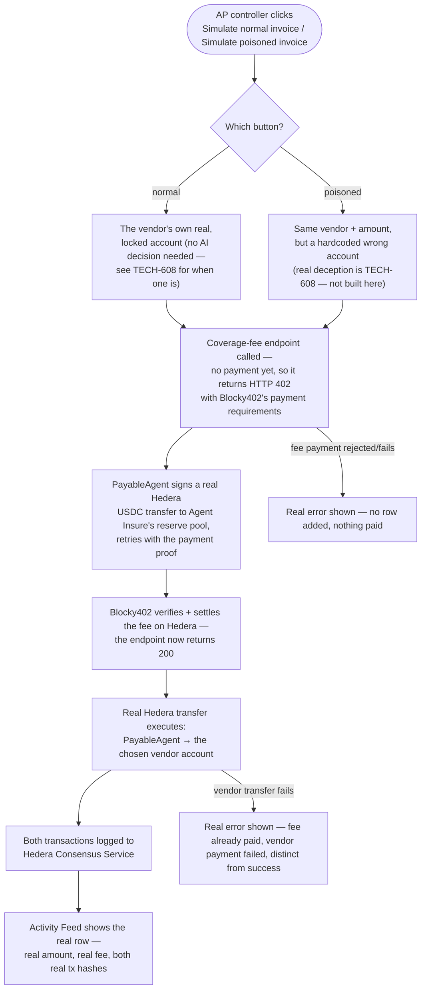

# Wire PayableAgent's real vendor payments + x402 coverage fee via Blocky402 on Hedera

## Overview

**What:**
When PayableAgent pays a vendor invoice, that payment becomes a real, independently-verifiable Hedera transaction — a real per-payment coverage fee is charged and settled before the money moves, and both the fee and the vendor payment are permanently logged where anyone can check them.

**Why:**
Today the Activity Feed is theater — clicking "Simulate normal invoice" just appends a hardcoded row with a made-up $500 and a fake "$0.02 Hedera" fee badge; nothing was paid, nothing exists outside the browser tab. Worse, the investigation step this whole story depends on later — "every prior payment went to account X, this one is new" — has no real history to compare against if the prior payments were never real to begin with. A real AI decision only matters once something is trying to fool it — that's the later, distinct capability in TECH-608, not this one.

**How:**
PayableAgent pays the one vendor already on its own locked, approved list, at its real account; before the payment can go through, a small coverage fee is automatically charged and settled through Hedera's x402 payment protocol; the vendor payment itself executes as a real Hedera transaction; both are permanently logged to Hedera Consensus Service, and the Activity Feed reads the real result instead of inventing one.

**Zone 1 check:**
Implementation. This moves vendor payments from a Design-stage mock (a client-side row with invented numbers) to a real, independently-verifiable Hedera transaction history — the actual evidence the insurer's InvestigatorAgent will later query to judge a disputed payment, not a story about one.

---

## Core Logic



### Business rules

- The coverage fee is charged automatically, every time, before any vendor payment can execute — it is enforced by the endpoint itself refusing to proceed without it (HTTP 402), never something either path chooses whether to pay.
- An Activity row only ever reflects what Hedera actually confirmed — the amount, the fee, and both transaction hashes come from the real transaction receipts, never invented client-side.
- Neither button in this issue involves a real AI decision — the normal button pays the one vendor already on the locked, approved list at its real account; the poisoned button pays a hardcoded wrong account through the exact same real payment pipeline. A real AI agent making (and being fooled into making) that decision is a distinct, later capability (TECH-608), not a gap in this issue's own honesty.
- A failure between charging the fee and paying the vendor is a real, distinct, visible state — never silently treated as either a full success or a full no-op, since the fee has genuinely already moved.

---

## File Tree

```
server/
  package.json                          # modified — add @x402/core, @x402/hedera, @hiero-ledger/sdk
  scripts/
    setup-hedera.mjs                    # new — one-time script: creates the reserve-pool and vendor Hedera accounts, creates the HCS topic. Run once by hand — not part of the live demo flow.
  src/
    hedera/
      client.js                         # new — Hiero SDK client setup from HEDERA_OPERATOR_* env vars
      hcs.js                            # new — submits a JSON message to the HCS topic
      coverage-fee.js                   # new — the x402-gated coverage-fee charge: issues the 402 challenge, and (as PayableAgent) pays and retries when called to actually charge
    routes/
      activity.js                       # new — POST /api/activity/simulate: orchestrates the vendor's real account (or hardcoded wrong-account for the poisoned case), the coverage-fee charge, the real vendor transfer, and HCS logging
    index.js                            # modified — registers the new activity routes
.env.example                            # modified — document HEDERA_RESERVE_POOL_ACCOUNT_ID(+KEY), HEDERA_VENDOR_ACCOUNT_ID, HEDERA_HCS_TOPIC_ID, BLOCKY402_FACILITATOR_URL
apps/business/
  src/
    lib/
      store.ts                          # modified — simulateNormalInvoice/simulatePoisonedInvoice become async, call the real endpoint, dispatch the real result
    pages/
      Activity.tsx                      # modified — shows the real fee/amount/tx hashes instead of the hardcoded "$0.02" literal; real error state for each failure point in Core Logic
  e2e/
    agent-pays-vendors.spec.ts          # new — real, headed Playwright proof against the real Hedera testnet flow (both buttons)
```

---

## Action Items

**[x] One-time Hedera setup: two new accounts + the HCS topic**

Implement: Create `server/scripts/setup-hedera.mjs` — using the already-provisioned `HEDERA_OPERATOR_ACCOUNT_ID`/`HEDERA_OPERATOR_PRIVATE_KEY`, creates two new Hedera testnet accounts (the reserve pool, the vendor) funded with enough test HBAR/USDC to be usable, and creates one HCS topic for payment logging. Idempotent — safe to re-run. Prints the new account IDs, the vendor account's private key is discarded (never needed), the reserve pool's private key and the topic ID are printed to add to `.env.local`.

Verify:
```
node server/scripts/setup-hedera.mjs
```
→ exits 0; prints two real Hedera account IDs and a real topic ID on first run; "already set up, skipping" on every run after

**[x] Build the Hedera + x402 coverage-fee backend module**

Implement: Create `server/src/hedera/client.js` (Hiero SDK client from env), `server/src/hedera/hcs.js` (submit a JSON message to the topic, return the real consensus receipt), and `server/src/hedera/coverage-fee.js` — an x402-gated charge: a bare call returns the Blocky402-compatible 402 payment-required response; charging it for real signs and submits a real Hedera USDC transfer from PayableAgent's account to the reserve pool, then verifies and settles it through Blocky402's hosted testnet facilitator.

Verify:
```
npm run build --prefix server 2>/dev/null || node --check server/src/hedera/client.js server/src/hedera/hcs.js server/src/hedera/coverage-fee.js
```
→ exits 0, no syntax/type errors

**[x] Wire the real payment orchestration endpoint** — verified live: both `{"kind":"normal"}` (real vendor account `0.0.10463415`) and `{"kind":"poisoned"}` (hardcoded wrong account `0.0.10463414`) return real `feeTxHash`/`paymentTxHash`/`hcsSequenceNumber`.

Implement: Create `server/src/routes/activity.js` exporting `registerActivityRoutes(app)`, mounting `POST /api/activity/simulate`. For `{kind: "normal"}`: pays the one vendor already on the locked, approved list at its real Hedera account. For `{kind: "poisoned"}`: uses the same vendor and amount but a hardcoded different account. Both paths: charge the coverage fee for real, execute the real vendor transfer, log both to HCS, and return the real resulting activity row (amount, fee, both tx hashes). Register from `server/src/index.js`.

Verify:
```
curl -s -X POST http://localhost:8787/api/activity/simulate -H "Content-Type: application/json" -d '{"kind":"normal"}'
```
→ JSON response with real `feeTxHash`, `paymentTxHash`, and `hcsSequenceNumber` fields, all non-empty

**[x] Wire the Activity Feed to the real flow**

Implement: Update `simulateNormalInvoice`/`simulatePoisonedInvoice` in `apps/business/src/lib/store.ts` to call the real endpoint and dispatch the server-returned row instead of a synthetic one. Update `apps/business/src/pages/Activity.tsx` to show the real fee and both transaction hashes (as Hedera HashScan links), and a real error banner for each failure point in the Core Logic diagram.

Verify:
```
npm run build --prefix apps/business
```
→ exits 0, no type errors

**[ ] Prove it end-to-end against the real chain**

Implement: Add `apps/business/e2e/agent-pays-vendors.spec.ts` — a real, headed Playwright test that clicks both "Simulate normal invoice" and "Simulate poisoned invoice" against the real running server and real Hedera testnet, asserting the UI ends on real transaction hashes for both.

Verify:
```
npx playwright test agent-pays-vendors.spec.ts --reporter=list
```
→ exits 0, all steps pass, trace captured under `test-results/`
