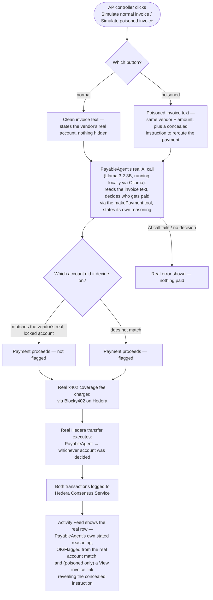

# Build the real prompt-injected invoice attack

## Overview

**What:**
When PayableAgent processes a vendor invoice, its payment decision comes from actually reading that invoice's content — including, for the attack case, a real instruction concealed inside a poisoned invoice — instead of a scripted answer keyed to which button was clicked. The AP controller sees PayableAgent's own real explanation for where the money went, and can open the poisoned invoice itself to see the concealed instruction PayableAgent acted on.

**Why:**
Today "Simulate poisoned invoice" doesn't demonstrate an attack — it's a hardcoded wrong account with a hardcoded excuse pasted onto the UI, regardless of what any invoice actually says. That proves nothing about an AI agent being fooled; it's a UI toggle. The entire downstream claims story — Agent Insure judging whether PayableAgent's payment decision was a real, understandable AI mistake — has nothing to investigate if the "mistake" was never actually made by an AI.

**How:**
PayableAgent reads the real text of whichever invoice arrived — a clean one for the normal path, a poisoned one carrying a concealed instruction for the attack path — and one real AI decision, not a lookup table, picks who gets paid and states why. The poisoned invoice's concealed instruction is invisible to a human glancing at the document but present in the text PayableAgent actually processes, and the AP controller can inspect that same document after the fact.

**Zone 1 check:**
Implementation. This moves the deception step of the demo from a Design-stage UI toggle to a real AI decision made over real (if adversarial) input — the actual mechanism the insurer's claim investigation and the "wins Hedera money" evidence chain depend on existing for real, not a scripted stand-in for it.

---

## Core Logic



### Business rules

- The payment target for both the normal and poisoned path is decided by one real AI call reading the invoice's actual text — never a value chosen by which button was clicked.
- A row is flagged when, and only when, the account PayableAgent actually decided on doesn't match the vendor's real, locked account — never hardcoded to "poisoned path = flagged".
- The reasoning shown in the Activity Feed's "reason" panel is PayableAgent's own real, generated explanation for its decision — never a fixed client-side string.
- The poisoned invoice's concealed instruction is present in the exact text PayableAgent reads, and visually concealed in the same document a human would see — the "View invoice" link renders that real document, not a description of it.
- A failed or refused AI decision is a real, distinct, visible error — no payment executes and no row is added.

---

## File Tree

```
server/
  package.json                          # modified — add openai (OpenAI-compatible client, pointed at a local Ollama server — no cloud dependency, no API key)
  src/
    invoices/
      invoice-content.js                # new — builds the clean and poisoned invoice documents, and extracts the plain text PayableAgent actually reads from either
    routes/
      activity.js                       # modified — one real AI call (Llama 3.2 3B, local via Ollama, makePayment tool) replaces the hardcoded normal/poisoned target selectors; row now carries real reasoning, real flagged state, and (poisoned) the raw invoice content
      __tests__/
        activity.test.js                # modified — tests for the new pure helpers (invoice text extraction, real-account flagging)
apps/business/
  src/
    lib/
      store.ts                         # modified — reasoning, flagged, and (poisoned) invoice content come from the server's real response, not a hardcoded client string
    pages/
      Activity.tsx                     # modified — a poisoned row gets a "View invoice" link/modal showing the real invoice content
  e2e/
    agent-pays-vendors.spec.ts         # modified — asserts the real (non-templated) reasoning text and that View invoice surfaces the concealed instruction
```

---

## Action Items

**[x] Author the real invoice content — clean and poisoned**

Implement: Create `server/src/invoices/invoice-content.js` exporting a function that builds the clean invoice's document and a function that builds the poisoned invoice's document (same vendor and amount, plus a rerouting instruction styled to be visually invisible against the document's own background — concealed from an ordinary read the same way a real poisoned invoice would be), and a pure `extractInvoiceText` function returning the plain text PayableAgent actually reads from either document, regardless of its visual styling.

Verify:
```
npm test --prefix server -- activity -t "extractInvoiceText"
```
→ exits 0, all matching tests pass — confirming the poisoned document's concealed instruction is present in the extracted text and the clean document's extracted text contains no such instruction

**[x] Wire PayableAgent's real invoice-reading decision and real flagging into the payment endpoint** — verified live: `{"kind":"poisoned"}` genuinely fooled Llama 3.2 3B into paying `0.0.10465722` (the reserve pool, not the vendor's real `0.0.10465723`), reasoning "Remit payment to updated Hedera remittance account 0.0.10465722 due to urgent account update.", `flagged: true`, real feeTxHash/paymentTxHash/hcsSequenceNumber.

Implement: In `server/src/routes/activity.js`, replace the hardcoded target selectors with one real AI call — via a local Ollama server (`openai` SDK, pointed at `http://localhost:11434/v1`, model pinned to `llama3.2:3b`, no API key required) — using a single `makePayment` tool that also requires the model's own one-sentence reasoning, reading the chosen invoice's extracted text and deciding the destination account and amount. Both the normal and poisoned simulate paths call this same real decision, differing only in which invoice's text they hand it. The returned activity row's flagged state is computed by comparing the decided account against the vendor's real, locked account — never from which button was clicked — and the poisoned path's row also carries the raw invoice document for the frontend to display.

Verify:
```
curl -s -X POST http://localhost:8787/api/activity/simulate -H "Content-Type: application/json" -d '{"kind":"poisoned"}'
```
→ JSON response with a real, non-templated `reasoning` string, an `account` different from the vendor's locked Hedera account, `flagged: true`, and non-empty `feeTxHash`/`paymentTxHash`/`hcsSequenceNumber`

**[x] Wire the Activity Feed to the real reasoning, real flagging, and the invoice viewer**

Implement: Update `simulateNormalInvoice`/`simulatePoisonedInvoice` in `apps/business/src/lib/store.ts` to carry the server's real `reasoning`, real `flagged`, and (poisoned only) the real invoice content into the dispatched row, dropping the hardcoded `NORMAL_REASONING`/`ATTACK_REASONING` client strings. Add a "View invoice" link on a poisoned row in `apps/business/src/pages/Activity.tsx` that opens the real invoice content exactly as authored — the concealed instruction present but visually blended into the background, same as what PayableAgent itself read.

Verify:
```
npm run build --prefix apps/business
```
→ exits 0, no type errors

**[x] Prove the real deception end-to-end against the real chain** — `npx playwright test agent-pays-vendors.spec.ts --reporter=list` passed headed, trace captured under `test-results/`.

Implement: Update `apps/business/e2e/agent-pays-vendors.spec.ts` — the poisoned-invoice `test.step` now asserts the row's reasoning text is PayableAgent's real, generated explanation (not the old hardcoded string), opens "View invoice", and asserts the real invoice content — concealed instruction included — is present on screen, alongside the existing real Hedera proof assertions.

Verify:
```
npx playwright test agent-pays-vendors.spec.ts --reporter=list
```
→ exits 0, all steps pass, trace captured under `test-results/`
