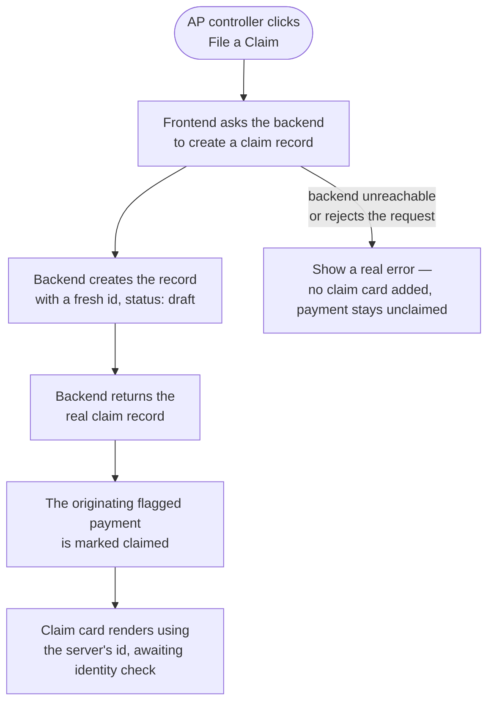

# Wire claim filing to a real backend record

## Overview

**What:**
When Northbeam's AP controller files a claim, that claim becomes one real, shared record the whole business can point to — not something that only exists on the one screen where it was filed.

**Why:**
Today, filing a claim only changes what's on the AP controller's own device. Nothing survives a refresh from a different machine, and nobody else — not the identity check that follows, not Fidelis's investigator, not the eventual payout — has a real, shared thing to reference. Every real step still ahead in this journey needs one true claim record to act against, not a browser-only guess that a different screen would disagree with.

**How:**
The moment a claim is filed, the system hands it a permanent identity from one shared record-keeper, instead of each screen inventing its own. Everything downstream — proving identity, investigating, paying out — will refer back to that same identity.

**Zone 1 check:**
Implementation. This moves claim filing from a Design-stage mock (a claim id invented locally, per browser, with nothing behind it) to a real, independently-verifiable server-side record — the shared anchor every later real step (identity check, investigation, payout) will reference instead of trusting the frontend's own say-so.

---

## Core Logic



### Business rules

- A claim record only exists once the backend confirms it — the frontend never invents a claim id on its own.
- The originating flagged payment is only marked claimed after the backend confirms the record was created — a failed request leaves it unclaimed and refileable.
- Every claim record starts life with a `draft` status on the backend the moment it's created — this is the backend's own bookkeeping and is independent of the claim card's on-screen label (which continues to prompt for the identity check immediately, unchanged).

---

## File Tree

```
server/
  src/
    routes/
      claims.js            # new — POST /api/claims: creates an in-memory claim record (id, vendor, amount, activityId, status "draft"), returns it as JSON
    index.js                # modified — registers the new claims routes alongside the existing World routes
apps/northbeam/
  src/
    lib/
      store.ts              # modified — file-claim calls the backend first and uses its returned id; only marks the activity row claimed once that call succeeds
    pages/
      Claims.tsx             # modified — file-claim handler awaits the now-async call
```

---

## Action Items

**[x] Add a real claims endpoint and wire it into the shared backend**

Implement: Create `server/src/routes/claims.js`, exporting a claim-creation function and `registerClaimRoutes(app)` mounting `POST /api/claims` — accepts a vendor, amount, and originating activity id, creates a claim record with a fresh id and a `draft` status, and returns it as JSON. Register it from `server/src/index.js` alongside the existing World routes.

Verify:
```
curl -s -X POST http://localhost:8787/api/claims -H "Content-Type: application/json" -d '{"vendor":"Acme Corp","amount":500,"activityId":"a1"}'
```
→ JSON response with a real `id` field and `"status":"draft"`

**[x] Wire claim filing on the frontend to the real record**

Implement: Update `fileClaim` in `apps/northbeam/src/lib/store.ts` to call the backend's `POST /api/claims` first and use its returned id for the new claim entry, only marking the originating activity row claimed once that call succeeds. Update `apps/northbeam/src/pages/Claims.tsx`'s file-claim handler to await the now-async call.

Verify:
```
npm run build --prefix apps/northbeam
```
→ exits 0, no type errors

---

## Known gap — flagged, not resolved here

This issue has a real, user-visible outcome (filing a claim now hits a real backend), which per `/sprint`'s rules means it should prove itself through `/e2e-verify` before its PR opens. `tools/journey-tracker/` (the `journey.json` file and schema that skill matches against) does not exist anywhere in this repo yet — it's referenced by the `/sprint` and `/e2e-verify` skill definitions but was never actually built. There is no Goal/Step for this issue to map to.

Treating this as the "infra/config only — no Goal/Step" branch and proceeding straight to manual browser verification + the curl/build checks above, since building `journey.json` from scratch is its own, separate piece of work and out of scope for a 1-point claim-filing ticket. Flagging so this isn't silently glossed over.
