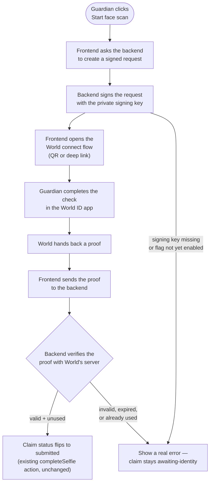

# Wire the real World Selfie Check SDK into claim filing

## Overview

**What:**
Before a claim reaches Fidelis, Northbeam's AP controller (Guardian) must prove they're a real, live human — with a real identity check, not a placeholder that always succeeds.

**Why:**
Today the "prove identity" step is a fake — it waits a second and a half and declares success no matter what. That means, as built, a claim can currently be filed by software alone with nobody accountable — exactly the fraud path this entire product exists to close, and exactly the bar World's own Selfie Check prize track is judged on: a real abuse-prevention signal, not a cosmetic one.

**How:**
Swap the fake wait-and-succeed step for a live check against World's identity service. The credentials that prove these requests genuinely come from Agent Insure are held somewhere that never reaches a user's browser, and both Northbeam and Fidelis will be able to share that same holding place for future secrets rather than each needing their own.

**Zone 1 check:**
Implementation. This moves the claim-filing flow's identity check from a Design-stage mock (hardcoded, always-succeeds UI) to a real, independently-verifiable implementation — the signal InvestigatorAgent and the submission judging will eventually rely on becomes genuine instead of simulated.

---

## Core Logic



### Business rules

- The signing key never leaves the backend — the frontend only ever receives a connect URL, never the key itself.
- A claim only moves out of `awaiting-identity` when the backend independently confirms a valid, unused proof — the frontend's own claim of success is never trusted on its own.
- A failed, expired, or not-yet-enabled request shows a real error state — it never silently falls back to "verified" the way the removed mock did.
- Sandbox vs. production is one config value, not hardcoded — the same code points at the real thing later without changes.

---

## File Tree

```
server/
  package.json                     # new — minimal Express service, own dependencies
  src/
    index.ts                       # new — Express app: loads root .env.local, CORS for both frontend origins, health route, mounts world routes
    routes/
      world.ts                     # new — POST /api/world/request (sign) + POST /api/world/verify (check proof)
apps/northbeam/
  package.json                     # modified — adds @playwright/test as a dev dependency
  playwright.config.ts             # new — E2E config, trace capture on for every run
  .env.example                     # new — VITE_API_URL only (no secrets; this file is safe to expose to the browser)
  e2e/
    selfie-check.spec.ts           # new — Playwright E2E: happy path + failure path through the real UI, network-mocked at the World/backend boundary
  src/
    components/
      SelfieModal.tsx              # modified — real World connect flow replaces the setTimeout fake
```

---

## Action Items

**[x] Scaffold the shared backend service**

Implement: Create `server/package.json` and `server/src/index.ts` — a minimal Express app that loads environment variables from the repo root `.env.local`, enables CORS for the Northbeam and Fidelis dev origins, and exposes a `GET /health` route. This is the one shared place future tickets (ENS writes, Hedera payments, InvestigatorAgent, PayoutAgent) will add their own routes to, instead of each building their own server.

Verify:
```
cd server && npm install && (npm start &) && sleep 1 && curl -s http://localhost:8787/health && kill %1
```
→ prints `{"status":"ok"}`

**[x] Add World request-signing and proof-verification routes**

Implement: Create `server/src/routes/world.ts` with two routes:
- `POST /api/world/request` — creates and signs a new World ID connect request for the claim-filing Selfie Check action
- `POST /api/world/verify` — forwards a completed proof to World's verify endpoint and returns whether it's genuinely valid

Verify:
```
curl -s -X POST http://localhost:8787/api/world/request -H "Content-Type: application/json" -d '{"claimId":"test"}'
```
→ valid JSON response with either a `connectUrl` field or a clear `error` field — never a raw crash or empty body

**[x] Replace the fake scan with the real World flow**

Implement: Rewrite `apps/northbeam/src/components/SelfieModal.tsx` to call the backend's `/api/world/request` and `/api/world/verify` routes instead of the `setTimeout` fake, showing real loading, verified, and error states. Add `apps/northbeam/.env.example` documenting `VITE_API_URL` (the shared backend's address). `onComplete` fires only after the backend confirms a genuinely verified proof — never on a client-side timer.

Verify:
```
npm run build --prefix apps/northbeam
```
→ exits 0, no type errors

---

## Known dependency (not blocking this build)

World's Selfie Check feature flag (TECH-604) is not approved yet. Every Action Item above builds and runs regardless — only the very last step (Guardian actually completing a live check successfully) is blocked on that flag. Once TECH-604 lands, no code changes here — it just starts working end to end.
