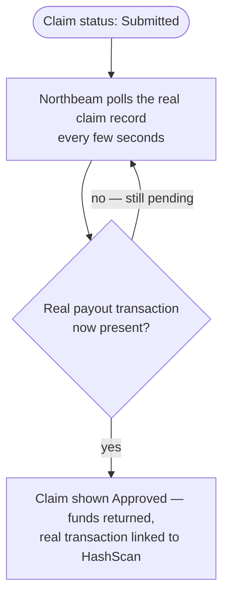

# Wire real payout confirmation via Hedera Mirror Node polling

## Overview

**What:**
Once Agent Insure pays a claim for real, Northbeam's own portal notices and shows the claim as approved, with the real transaction anyone can independently check on Hedera's public ledger.

**Why:**
A resolution nobody ever sees isn't resolved. Right now a filed claim just sits "Submitted — now with Agent Insure for investigation" forever on Northbeam's side, even after Agent Insure has already paid it back for real on Hedera, because nothing on Northbeam's side ever checks.

**How:**
While a claim is waiting, Northbeam's portal periodically checks in on the real claim record, and the moment a real payout appears, shows the claim as approved with that transaction linked to Hedera's public explorer.

**Zone 1 check:**
Implementation. This closes the loop on the Operate & Recover journey — the last unproven step after TECH-612 (real verdict) and TECH-613 (real payout): the resolution those two produce finally becomes visible on the side that suffered the original loss.

---

## Core Logic



### Business rules

- Polling only runs for claims still waiting — it stops once a claim is resolved.
- The resolved state always shows the real Hedera transaction, never a status label alone.

---

## File Tree

```
apps/business/
  src/
    lib/
      store.ts                     # modified — ClaimEntry gains a real payoutTxHash; StoreProvider polls the real claims endpoint for claims still submitted
    pages/
      Claims.tsx                   # modified — the approved claim card links its real transaction to HashScan
  e2e/
    claim-payout-confirmed.spec.ts # new — real, headed Playwright proof against the real chain
```

---

## Action Items

**[x] Poll for the real payout**

Implement: In `apps/business/src/lib/store.ts`, add a real `payoutTxHash` field to `ClaimEntry`. While any claim's status is `submitted`, `StoreProvider` polls the real claims endpoint every few seconds; when a matching claim's real record shows it's been paid, dispatches the claim's real approved status and transaction hash.

Verify:
```
npm run build --prefix apps/business
```
→ exits 0, no type errors

**[x] Northbeam shows the real, resolved payout**

Implement: Update the approved `ClaimCard` body in `apps/business/src/pages/Claims.tsx` to link the claim's real transaction to HashScan, alongside the existing "Approved — funds returned" line.

Verify:
```
npm run build --prefix apps/business
```
→ exits 0, no type errors

**[x] Prove the real confirmation end-to-end against the real chain**

Implement: Add a new Playwright spec under `apps/business/e2e/` that seeds a real claim, investigates it, and pays it out via direct backend calls (the precondition — a different actor's already-proven Goals, not re-driven through their own UI), then opens Northbeam's Claims page and asserts the real "Approved — funds returned" state and real HashScan-linked transaction render on screen once polling picks it up.

Verify:
```
npx playwright test claim-payout-confirmed.spec.ts --reporter=list
```
(from `apps/business`) → exits 0, all steps pass, trace captured under `test-results/`
