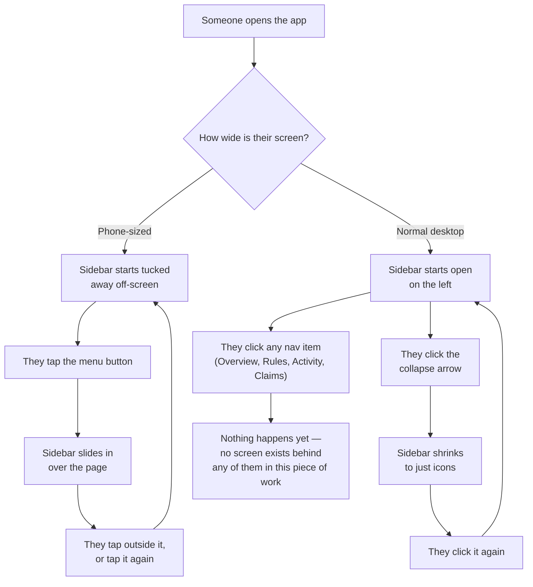

# Scaffold Northbeam Portal app shell

## Overview

**What:** Northbeam Distributors gets the permanent navigation shell of its own real application — the sidebar and layout every future screen will sit inside — instead of a shareable prototype link.

**Why:** Everything Northbeam-side currently lives only as a prototype link, which cannot itself be the submitted product. The shell is the one piece every other Northbeam screen depends on, so it comes first and stays deliberately minimal — no screen content yet.

**How:** Stand up the application with its full navigation — sidebar, real routing, and all four screens (Overview, Rules, Activity, Claims) — at 1:1 content and behavior parity with the already-approved published prototype, sharing one in-memory store so state (locking rules, a simulated attack, a filed claim) carries across routes exactly as it does in the prototype.

**Scope history:** This spec shipped in three passes on the same branch, each correcting a scope call that undershot the actual ask: shell-only → shell + Overview content → full routing with Rules/Activity/Claims built out. The final state above is what shipped; the Action Items below record each pass.

**Zone 1 check:** Advances **Implementation** — a design already approved (published prototype + `DESIGN.northbeam.md`) is cheap to verify against here because the target output is fully specified in advance, not discovered during the work.

---

## Core Logic



### Business rules

- On a phone-sized screen the sidebar always starts hidden; on a normal-sized screen it always starts open. This depends only on how wide the screen is, not on anything the person did last time.
- Collapsing to icons-only is a desktop-only move — on a phone the sidebar is all-or-nothing (a slide-in panel), never a collapsed icon rail.
- No nav item goes anywhere yet — this issue is the shell only. Every item renders so the sidebar looks complete, but none are wired to a real screen.

This is pure UI — a navigation shell with no data, no branching, and nothing worth testing. Verification is visual parity against the published prototype plus a clean build.

---

## File Tree

```
apps/northbeam/
├── package.json                     # new — Vite + React 19 + TS + Tailwind v4, mirrors tools/journey-tracker's dependency set
├── vite.config.ts                   # new — mirrors tools/journey-tracker's Vite + Tailwind plugin config
├── tsconfig.json                    # new — mirrors tools/journey-tracker's TS config
├── index.html                       # new — Vite entry; loads Plus Jakarta Sans + JetBrains Mono
├── src/main.tsx                     # new — React root mount
├── src/App.tsx                      # new — renders AppSidebar + a bare placeholder main area
├── src/index.css                    # new — Tailwind v4 theme block, recolored from tools/journey-tracker's per DESIGN.northbeam.md
├── src/lib/utils.ts                 # copied verbatim from tools/journey-tracker (cn helper) — zero review cost
├── src/hooks/useIsMobile.ts         # copied verbatim from tools/journey-tracker — zero review cost
├── src/components/ui/button.tsx     # copied verbatim from tools/journey-tracker — zero review cost
├── src/components/ui/separator.tsx  # copied verbatim from tools/journey-tracker — zero review cost
├── src/components/ui/sheet.tsx      # copied verbatim from tools/journey-tracker (sidebar's mobile drawer) — zero review cost
├── src/components/ui/sidebar.tsx    # copied verbatim from tools/journey-tracker (real shadcn sidebar primitive) — zero review cost
├── src/components/AppSidebar.tsx    # new — Northbeam nav (Overview/Rules/Activity/Claims, all inert except Overview) + Guardian footer
├── src/components/ui/card.tsx       # new — Card / CardHeader / CardContent primitives
├── src/components/ui/badge.tsx      # new — Badge with neutral/success/warning/destructive/hedera/ens/world variants
├── src/components/StatTile.tsx      # new — label/value/caption stat card
├── src/components/DemoBar.tsx       # new — the top demo-guide strip (hint text, reset button), matching the published prototype exactly
├── src/lib/seed-data.ts             # new — hardcoded rules/activity/claims matching the published prototype's seed state
└── src/pages/Overview.tsx           # new — banner, 4 stat tiles, pipeline timeline, recent-activity table; all values read directly off seed-data.ts inline, no separate logic layer
```

---

## Action Items

**[x] Scaffold the Vite + React + TypeScript + Tailwind v4 project**

Implement: `apps/northbeam/package.json`, `vite.config.ts`, `tsconfig.json`, `index.html` mirroring `tools/journey-tracker`'s proven config, adapted for the `apps/northbeam` package.

Verify:
```
cd apps/northbeam && npm install && npm run build
```
→ exits 0

**[x] Port journey-tracker's shadcn UI primitives unmodified**

Implement: copy `src/lib/utils.ts`, `src/hooks/useIsMobile.ts`, `src/components/ui/button.tsx`, `separator.tsx`, `sheet.tsx`, `sidebar.tsx` verbatim from `tools/journey-tracker`.

Verify:
```
diff tools/journey-tracker/src/components/ui/sidebar.tsx apps/northbeam/src/components/ui/sidebar.tsx
```
→ no output (files identical)

**[x] Apply Northbeam's teal theme tokens**

Implement: `apps/northbeam/src/index.css` — Tailwind v4 theme block using `DESIGN.northbeam.md`'s light/dark color values in place of `tools/journey-tracker`'s own teal, plus the Plus Jakarta Sans and JetBrains Mono font declarations.

Verify:
```
grep -q "1F6F5C" apps/northbeam/src/index.css && echo FOUND
```
→ `FOUND`

**[x] Build AppSidebar with Northbeam's nav and Guardian footer**

Implement: `src/components/AppSidebar.tsx`, composed from the ported sidebar primitives — Overview/Rules/Activity/Claims nav items (all inert) and the Guardian avatar/role footer block, matching the published prototype.

Verify:
```
cd apps/northbeam && npx tsc --noEmit
```
→ exits 0

**[x] Wire the shell into a running app**

Implement: `src/App.tsx` rendering `AppSidebar` plus a bare placeholder main area, `src/main.tsx` entry point.

Verify:
```
cd apps/northbeam && npm run build
```
→ exits 0

**[x] Build the Overview screen at 1:1 parity with the published prototype**

Implement: `src/components/ui/card.tsx`, `src/components/ui/badge.tsx`, `src/components/StatTile.tsx`, `src/components/DemoBar.tsx`, `src/lib/seed-data.ts`, and `src/pages/Overview.tsx` — reproducing the published artifact's Overview screen exactly: the top demo-guide bar (hint text + reset), the ENS-published banner with the ENS name and a Copy action, four stat tiles (Coverage limit $5,000, Policy status Pending, Claims filed 1, Claims paid 1), the "How this policy exists" pipeline (Underwriting / Certificate / Claims + vault), and the Recent activity table (the two seeded Acme Corp payments). Wire `App.tsx` to render `Overview` in the main content area instead of the placeholder.

Verify:
```
cd apps/northbeam && npm run build
```
→ exits 0, and the rendered page matches the published prototype's Overview screen content and layout

**[x] Wire real routing and build Rules, Activity, and Claims at full parity**

**Scope correction (2026-09-08, second):** Every nav item must actually navigate and every screen must be as interactive as the published prototype — not just Overview. This adds `react-router-dom`, removes the earlier "nav items are inert" business rule, and builds the three remaining screens with their real local-state interactivity: **Rules** (budget cap + vendor list display, "Lock Rules On-Chain" button that flips `rules.locked` and unlocks the rest of the demo), **Activity** (feed table, "Simulate normal invoice" and "Simulate poisoned invoice" buttons that append rows, disabled until rules are locked), **Claims** (claim cards, "+ File a Claim" enabled only when a flagged-and-unclaimed activity row exists, a Selfie Check modal that simulates a face scan and marks the claim submitted). State is shared across all four routes via a single top-level store (matching the published prototype's seed data), persisted to `localStorage` the same way the prototype does, so locking rules on `/rules` actually unlocks the attack button on `/activity`, etc.

Implement: `src/lib/store.ts` (shared state + actions via React context + `useReducer`, replacing the static `seed-data.ts` import), `src/pages/Rules.tsx`, `src/pages/Activity.tsx`, `src/pages/Claims.tsx`, `src/components/SelfieModal.tsx`, updated `src/App.tsx` (real `react-router-dom` routes for `/`, `/rules`, `/activity`, `/claims`), updated `src/components/AppSidebar.tsx` (nav items become real `<Link>`s with active-route highlighting), updated `src/pages/Overview.tsx` and `src/components/DemoBar.tsx` to read from the shared store.

Verify:
```
cd apps/northbeam && npm run build && npx tsc --noEmit
```
→ both exit 0, and clicking each of the four sidebar nav items in the running app navigates to a distinct, populated screen
