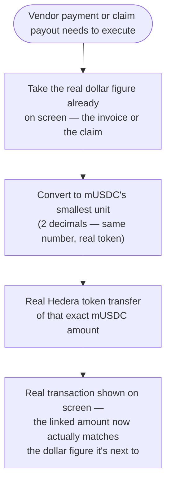

# Switch the real payment rail from HBAR to mock USDC (mUSDC)

## Overview

**What:**
Every dollar figure this product shows — the invoice PayableAgent pays, the claim Northbeam gets reimbursed — now moves as that exact real dollar amount on Hedera, not a fixed, unrelated token amount that happens to be worth a few cents.

**Why:**
Today a vendor payment or a claim payout says "$500" on screen, but the real on-chain transfer is a fixed 1 HBAR (worth about 7 cents) — completely disconnected from the number anyone actually sees. Real USDC's testnet treasury has no public faucet (already hit and documented building the vendor-payment pipeline), so nothing genuinely dollar-denominated has ever moved. Anyone who checks the real transaction against the claimed dollar amount today finds they don't match.

**How:**
Mint a real, dollar-pegged Hedera token this product fully controls — a mock USDC — and use it, for its real face value, everywhere a payment's dollar amount currently gets replaced by an unrelated fixed HBAR figure: the vendor payment PayableAgent makes, and the claim payout PayoutAgent executes. The coverage fee stays HBAR — a separate, already-proven mechanism, not part of this mismatch.

**Zone 1 check:**
Implementation. This makes the product's own headline numbers — "$500 paid," "$500 returned" — independently verifiable for the first time, rather than a plausible-looking on-screen figure with no real value behind it.

---

## Core Logic



### Business rules

- The vendor payment and the claim payout each move mUSDC equal to their own real, displayed dollar figure — never a fixed amount decoupled from what's shown.
- The x402 coverage fee is unaffected — it stays a small, fixed HBAR premium, a separate and already-proven mechanism.
- mUSDC is real: a real Hedera token, really transferred, really checkable on Hedera's public ledger — just not tied to real-world dollar redemption, same honesty level HBAR already had on testnet.

---

## File Tree

```
server/
  scripts/
    setup-musdc.mjs                 # new — one-time: creates the mUSDC token (treasury = PayableAgent's operator account) and funds the reserve pool with real mUSDC to pay claims from
  src/
    routes/
      activity.js                   # modified — vendor payment transfers real mUSDC equal to the invoice's real dollar amount
      claims.js                     # modified — claim payout transfers real mUSDC equal to the claim's real dollar amount
.env.example                        # modified — document HEDERA_MUSDC_TOKEN_ID
apps/business/
  src/
    pages/
      Activity.tsx                  # modified — the vendor payment's real transaction is labeled mUSDC
      Claims.tsx                    # modified — the claim payout's real transaction is labeled mUSDC
    lib/
      store.ts                      # unmodified — payoutTxHash already flows through unchanged
  e2e/
    agent-pays-vendors.spec.ts      # modified — asserts the real transferred mUSDC amount equals the invoice's real dollar amount
apps/hq/
  src/
    routes/
      ClaimsQueue.tsx                # modified — the claim payout's real transaction is labeled mUSDC
  e2e/
    verify-and-pay-claim.spec.ts    # modified — asserts the real transferred mUSDC amount equals the claim's real dollar amount
```

---

## Action Items

**[x] Create and fund the real mUSDC token**

Implement: Create `server/scripts/setup-musdc.mjs` — a one-time, idempotent script (same convention as `setup-hedera.mjs`) that creates a real Hedera fungible token (2 decimals, treasury = PayableAgent's operator account, freely mintable), transfers a real starting mUSDC balance to the reserve pool account so it can pay claims out, and prints the token id to add as `HEDERA_MUSDC_TOKEN_ID` in `.env.local`. Document `HEDERA_MUSDC_TOKEN_ID` in `.env.example`.

Verify:
```
node --check server/scripts/setup-musdc.mjs
```
→ exits 0, no syntax errors

**[x] Vendor payments move real, dollar-equal mUSDC**

Implement: In `server/src/routes/activity.js`, change `executeVendorTransfer` to transfer real mUSDC (via `HEDERA_MUSDC_TOKEN_ID`) instead of a fixed HBAR amount, moving exactly the invoice's real dollar amount (converted to mUSDC's smallest unit).

Verify:
```
node --check server/src/routes/activity.js
```
→ exits 0, no syntax errors

**[x] Claim payouts move real, dollar-equal mUSDC**

Implement: In `server/src/routes/claims.js`, change `executePayoutTransfer` to transfer real mUSDC instead of a fixed HBAR amount, moving exactly the claim's real dollar amount (converted to mUSDC's smallest unit) from the reserve pool to PayableAgent's account.

Verify:
```
node --check server/src/routes/claims.js
```
→ exits 0, no syntax errors

**[x] Show the real mUSDC transactions on screen**

Implement: Update `apps/business/src/pages/Activity.tsx`'s vendor payment transaction link and `apps/business/src/pages/Claims.tsx` / `apps/hq/src/routes/ClaimsQueue.tsx`'s payout transaction link to label the real transaction as mUSDC, so it's clear the linked amount is the real, dollar-equal transfer.

Verify:
```
npm run build --prefix apps/business && npm run build --prefix apps/hq
```
→ exits 0, no type errors

**[x] Prove the real, dollar-equal transfers end-to-end against the real chain**

Implement: Extend `apps/business/e2e/agent-pays-vendors.spec.ts` and `apps/hq/e2e/verify-and-pay-claim.spec.ts` to assert — via a real Hedera Mirror Node read of the actual transaction — that the real mUSDC amount transferred equals the invoice's/claim's real dollar figure, not just that a transaction happened.

Verify:
```
npx playwright test agent-pays-vendors.spec.ts --reporter=list
```
(from `apps/business`) and
```
npx playwright test verify-and-pay-claim.spec.ts --reporter=list
```
(from `apps/hq`) → both exit 0, all steps pass, traces captured under `test-results/`
