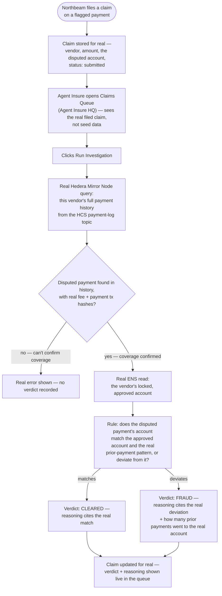

# Wire InvestigatorAgent to real Mirror Node history, ENS rules, and a real verdict

## Overview

**What:**
When the insurer opens a filed claim and runs an investigation, the verdict it reaches comes from real evidence — the disputed payment's own history on Hedera, and the spending rules actually locked on ENS — compared by a plain, explainable rule, instead of a canned "FRAUD" stamped on every claim. The claims queue itself shows the real claim Northbeam actually filed, not a fixed set of made-up examples.

**Why:**
Today the whole insurer side is theater: the claims list is three hardcoded rows that never change, and "Run Investigation" just flips a label from "New" to "Investigated" with the same pre-written verdict every time — nothing is read, nothing is compared, nothing is decided. The entire premise of this product — an insurer that independently verifies a disputed AI payment before paying out real money — has nothing to verify if the verification was never real.

**How:**
The insurer's judgment doesn't need to be an AI call to be real — it needs to be a real decision over real evidence. When an investigation runs, it pulls the disputed vendor's actual payment history from Hedera Mirror Node, confirms the disputed payment's own coverage fee genuinely settled, reads the vendor's real locked account from ENS, and applies one plain, stated rule: does the disputed payment's destination match the real prior pattern, or is it a genuine deviation. The reasoning shown is built from those real facts, not invented.

**Zone 1 check:**
Implementation. This moves claim investigation from a Design-stage mock (a fixed label flip over invented data) to a real decision made over real, independently-checkable evidence — the actual mechanism the payout step (a later issue) has to trust before real money moves.

---

## Core Logic



Reasoning stays bare-bones — "matches the vendor's locked account" or "does not match the vendor's locked account" — no extra pattern-counting detail.

### Business rules

- The claims queue shows the real set of claims Northbeam has actually filed — never a fixed seed list.
- A verdict is only ever produced from real evidence fetched at investigation time — real Mirror Node history, real ENS rules — never cached, invented, or the same canned answer every time.
- The rule comparing evidence to the verdict is plain and stated in the reasoning shown — does the disputed payment's account match the vendor's real, locked account, or not — never a black box.
- If the disputed payment's own coverage fee can't be confirmed from real history, that's a real, distinct, visible error — no verdict is recorded.
- Investigating a claim never mutates or replays the original payment — it only reads real, already-settled history and rules.

---

## File Tree

```
.env.example                              # modified — add ENS_RESOLVER_ADDRESS + ENS_AGENT_NAME (server-side read, same public values apps/business already uses)
server/
  src/
    hedera/
      mirror-node.js                      # new — queries the real HCS payment-log topic via Hedera Mirror Node's public REST API, decodes each message into a payment record
    ens/
      read-rules.js                       # new — server-side port of the read-only half of apps/business's ens.ts: reads the vendor's locked account from ENS, no wallet needed
    investigator/
      judge-claim.js                      # new — pure rule: given real history + the vendor's approved account + the disputed payment, confirms coverage and decides CLEARED vs FRAUD with real, stated reasoning
    routes/
      claims.js                           # modified — claims now persist in memory; POST /api/claims stores the disputed account; new GET /api/claims (list) and POST /api/claims/:id/investigate (runs the real investigation)
      __tests__/
        claims.test.js                    # new — tests for judge-claim and the claims store helpers
apps/business/
  src/
    lib/
      store.ts                            # modified — fileClaim sends the disputed payment's real account, not just vendor/amount
apps/hq/
  package.json                            # modified — dev/preview port 6323 → 6324 (pre-existing collision with apps/business, blocks running both together)
  src/
    App.tsx                               # modified — fetches the real claims list on load; Run Investigation calls the real investigate endpoint
    lib/
      claims/
        types.ts                          # modified — Claim carries the real disputed account; verdict is 'FRAUD' | 'CLEARED' | null
        data.ts                           # modified — drops the fake SEED_CLAIMS; pool balance stays as-is (a later issue's concern)
        transitions.ts                    # modified — drops the fake investigateClaim (the server decides now); payClaim untouched
  e2e/
    p2-investigate/m1-investigate/g1-investigatoragent-signs-verdict.spec.ts   # new — real, headed Playwright proof against the real chain
  playwright.config.ts                    # new — trace + video on, headed, matching apps/business's own config
```

---

## Action Items

**[x] Pull real evidence — Mirror Node history and ENS rules**

Implement: Create `server/src/hedera/mirror-node.js` exporting a function that queries Hedera Mirror Node's public REST API for the HCS payment-log topic's messages and decodes each into a payment record (vendor, account, amount, fee/payment tx hashes). Create `server/src/ens/read-rules.js` exporting a function that reads the vendor's locked, approved Hedera account from ENS — the read-only half of `apps/business/src/lib/ens.ts`'s logic, ported server-side (no wallet, no signature, a plain public RPC read). Document `ENS_RESOLVER_ADDRESS` and `ENS_AGENT_NAME` in `.env.example`.

Verify:
```
node --check server/src/hedera/mirror-node.js server/src/ens/read-rules.js
```
→ exits 0, no syntax errors

**[x] Decide the verdict with one plain rule**

Implement: Create `server/src/investigator/judge-claim.js` exporting a pure function that, given the vendor's real payment history, the vendor's real approved account, and the disputed payment (account + amount), finds the matching history entry and confirms it has real fee/payment transaction hashes, then returns `CLEARED` when the disputed account matches the approved account or `FRAUD` when it doesn't — with a bare-bones reasoning string stating which account was compared and whether it matched, nothing more.

Verify:
```
npm test --prefix server -- claims -t "judgeClaim"
```
→ exits 0, all matching tests pass — confirming a matching-account claim is CLEARED, a deviating one is FRAUD, and an unconfirmable one raises a real error

**[x] Wire real claim storage and the real investigate endpoint**

Implement: In `server/src/routes/claims.js`, replace the no-op claim creation with an in-memory claims store. `POST /api/claims` now stores the disputed account alongside vendor/amount and returns the stored claim. Add `GET /api/claims` returning every stored claim. Add `POST /api/claims/:id/investigate`, which pulls the real Mirror Node history and ENS rules, runs `judgeClaim`, records the real verdict and reasoning on the claim, and returns it.

Verify:
```
curl -s -X POST http://localhost:8787/api/claims -d '{"vendor":"Acme Corp","amount":500,"account":"0.0.<wrong-account>"}' -H "Content-Type: application/json" | jq -r .id | xargs -I{} curl -s -X POST http://localhost:8787/api/claims/{}/investigate
```
→ JSON response with a real `verdict` and a real, non-templated `reasoning` string citing the actual account comparison

**[x] Northbeam sends the real disputed account when filing a claim**

Implement: Update `fileClaim` in `apps/business/src/lib/store.ts` to include the flagged activity row's real `account` in the `POST /api/claims` body, so the claim InvestigatorAgent later reviews carries the actual disputed destination, not just the vendor name.

Verify:
```
npm run build --prefix apps/business
```
→ exits 0, no type errors

**[x] Agent Insure HQ shows the real claim and runs the real investigation**

Implement: Update `apps/hq/src/App.tsx` to fetch the real claims list from `GET /api/claims` on load instead of seeding from `SEED_CLAIMS`, and to call the real `POST /api/claims/:id/investigate` endpoint when "Run Investigation" is clicked, replacing the local `investigateClaim` transition. Update `apps/hq/src/lib/claims/types.ts` (the real `account` field, `verdict: 'FRAUD' | 'CLEARED' | null`) and drop the now-unused fake seed claims and `investigateClaim` transition. Fix `apps/hq/package.json`'s dev/preview port (6323 → 6324) so it can run alongside `apps/business` — a pre-existing collision, needed now that both apps run together for real.

Verify:
```
npm run build --prefix apps/hq
```
→ exits 0, no type errors

**[x] Prove the real investigation end-to-end against the real chain**

Implement: Add `apps/hq/playwright.config.ts` (trace + video on, headed, matching `apps/business`'s config) and `apps/hq/e2e/p2-investigate/m1-investigate/g1-investigatoragent-signs-verdict.spec.ts` — seeds a real disputed claim via a direct `POST /api/claims` call (the precondition, not replayed through Northbeam's own UI), then drives the real UI: opens the Claims Queue, clicks Run Investigation, and asserts the real verdict and real reasoning render on screen.

Verify:
```
npx playwright test g1-investigatoragent-signs-verdict.spec.ts --reporter=list
```
→ exits 0, all steps pass, trace captured under `test-results/`
