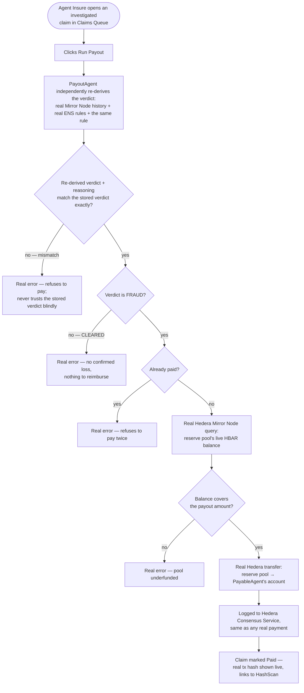

# Wire PayoutAgent to real verdict verification and real Hedera payout execution

## Overview

**What:**
Once Agent Insure's InvestigatorAgent confirms a claim is real fraud, a second, independent agent — PayoutAgent — checks that verdict for itself, confirms the reserve pool can actually cover it, and pays Northbeam back for real, with the transaction visible and independently checkable.

**Why:**
Today "Run Payout" is theater — it flips a status flag and subtracts from a number that lives only in the browser, with no check that the claim was ever actually fraud, no check the pool has money, and no real money moving. An insurer that pays out real money on a single agent's say-so, with nothing verifying it and no funds actually moving, isn't insurance — it's a label.

**How:**
PayoutAgent never takes InvestigatorAgent's word for it — it re-checks the same real evidence itself, confirms real fraud was found (not a cleared claim), confirms this hasn't already been paid, confirms the reserve pool genuinely has the funds on-chain, then executes a real, on-chain payment back to the account that suffered the loss.

**Zone 1 check:**
Implementation. This moves the payout step from a Design-stage mock (a status flip over a client-side number) to a real, independently-verified decision that moves real funds — the second half of the separation-of-duties guarantee TECH-612 started, and the actual mechanism real money would need to trust.

---

## Core Logic



### Business rules

- PayoutAgent never trusts InvestigatorAgent's stored verdict blindly — it independently re-derives the same verdict from the same real evidence before paying.
- Only a FRAUD verdict (a confirmed real deviation from the vendor's locked account) is ever paid out — a CLEARED claim has no loss to reimburse, and never offers a payout.
- A claim is never paid twice.
- The payout amount is fixed and decoupled from the claim's nominal dollar figure — the same real, fixed HBAR amount PayableAgent originally sent to the wrong account, reused as a single source of truth.
- The reserve pool's real, live on-chain balance is checked before every payout — never a client-side or cached number.

---

## File Tree

```
server/
  src/
    hedera/
      client.js                       # modified — add reserve-pool signing client (mirrors PayableAgent's own)
      mirror-node.js                  # modified — add a real, live account-balance read
    payout/
      authorize-payout.js             # new — pure rule: re-derived verdict must match, must be FRAUD, must not already be paid
    routes/
      activity.js                     # modified — export the fixed real transfer amount so payout can reuse it exactly
      claims.js                       # modified — new POST /api/claims/:id/payout: re-derive, authorize, check real balance, real transfer, real HCS log
      __tests__/
        claims.test.js                # modified — tests for authorize-payout and the payout endpoint's orchestration
apps/hq/
  src/
    lib/
      claims/
        types.ts                      # modified — Claim gains a real payoutTxHash field
        transitions.ts                # modified — drops the fake payClaim (server decides now)
    App.tsx                           # modified — Run Payout calls the real payout endpoint
    routes/
      ClaimsQueue.tsx                 # modified — Run Payout only offered for FRAUD + unpaid; CLEARED shows "not payable"; paid shows a real HashScan link
  e2e/
    verify-and-pay-claim.spec.ts      # new — real, headed Playwright proof against the real chain
```

---

## Action Items

**[x] Reserve pool can sign real transfers**

Implement: In `server/src/hedera/client.js`, add `getReservePoolClient`, `getReservePoolAccountId`, and `getReservePoolPrivateKey`, reading `HEDERA_RESERVE_POOL_ACCOUNT_ID` / `HEDERA_RESERVE_POOL_PRIVATE_KEY` the same way PayableAgent's own client helpers already read its credentials.

Verify:
```
node --check server/src/hedera/client.js
```
→ exits 0, no syntax errors

**[x] Real, live reserve-pool balance check**

Implement: In `server/src/hedera/mirror-node.js`, add a function that queries Hedera Mirror Node's real account endpoint for a given account id and returns its live HBAR balance.

Verify:
```
node --check server/src/hedera/mirror-node.js
```
→ exits 0, no syntax errors

**[x] PayoutAgent's pure authorization rule**

Implement: Create `server/src/payout/authorize-payout.js` exporting a pure function that, given the claim's stored verdict and reasoning, an independently re-derived verdict and reasoning, and the claim's current status, throws a real, distinct error when they don't match, when the verdict isn't `FRAUD`, or when the claim is already paid — and otherwise confirms payout is authorized.

Verify:
```
npm test --prefix server -- claims -t "authorizePayout"
```
→ exits 0, all matching tests pass — confirming a re-derivation mismatch, a CLEARED verdict, and an already-paid claim are each refused with a distinct reason, and a genuine unpaid FRAUD claim is authorized

**[x] Share the real transfer amount as a single source of truth**

Implement: Export the fixed real HBAR transfer amount already used for vendor payments from `server/src/routes/activity.js`, so the payout reuses the exact same amount PayableAgent originally sent to the wrong account.

Verify:
```
node --check server/src/routes/activity.js
```
→ exits 0, no syntax errors

**[x] Wire the real payout endpoint**

Implement: In `server/src/routes/claims.js`, add `POST /api/claims/:id/payout`: re-derives the verdict via the same real Mirror Node + ENS + judgment path investigation already uses, runs the authorization rule, checks the reserve pool's real live balance covers the transfer, executes a real Hedera transfer from the reserve pool to PayableAgent's account, logs it to Hedera Consensus Service, and records the real payout transaction hash and approved status on the claim.

Verify:
```
curl -s -X POST http://localhost:8787/api/claims -d '{"vendor":"Acme Corp","amount":500,"account":"0.0.<wrong-account>"}' -H "Content-Type: application/json" | jq -r .id | xargs -I{} sh -c 'curl -s -X POST http://localhost:8787/api/claims/{}/investigate > /dev/null; curl -s -X POST http://localhost:8787/api/claims/{}/payout'
```
→ JSON response with a real `payoutTxHash` and `status: "approved"`

**[x] Agent Insure HQ shows the real payout**

Implement: Update `apps/hq/src/lib/claims/types.ts` to add a real `payoutTxHash` field. Update `apps/hq/src/App.tsx`'s payout handler to call the real payout endpoint instead of the local transition. Update `apps/hq/src/routes/ClaimsQueue.tsx` so Run Payout only appears for a FRAUD, unpaid claim; a CLEARED claim shows a clear "not payable" state instead; a paid claim shows the real transaction linked to HashScan. Drop the now-unused fake `payClaim` transition.

Verify:
```
npm run build --prefix apps/hq
```
→ exits 0, no type errors

**[x] Prove the real payout end-to-end against the real chain**

Implement: Add a new Playwright spec under `apps/hq/e2e/` that seeds a real FRAUD-eligible claim, investigates it, runs the real payout, and asserts the real "Paid" state and real HashScan-linked transaction render on screen; also asserts a CLEARED claim never offers Run Payout.

Verify:
```
npx playwright test verify-and-pay-claim.spec.ts --reporter=list
```
(from `apps/hq`) → exits 0, all steps pass, trace captured under `test-results/`
