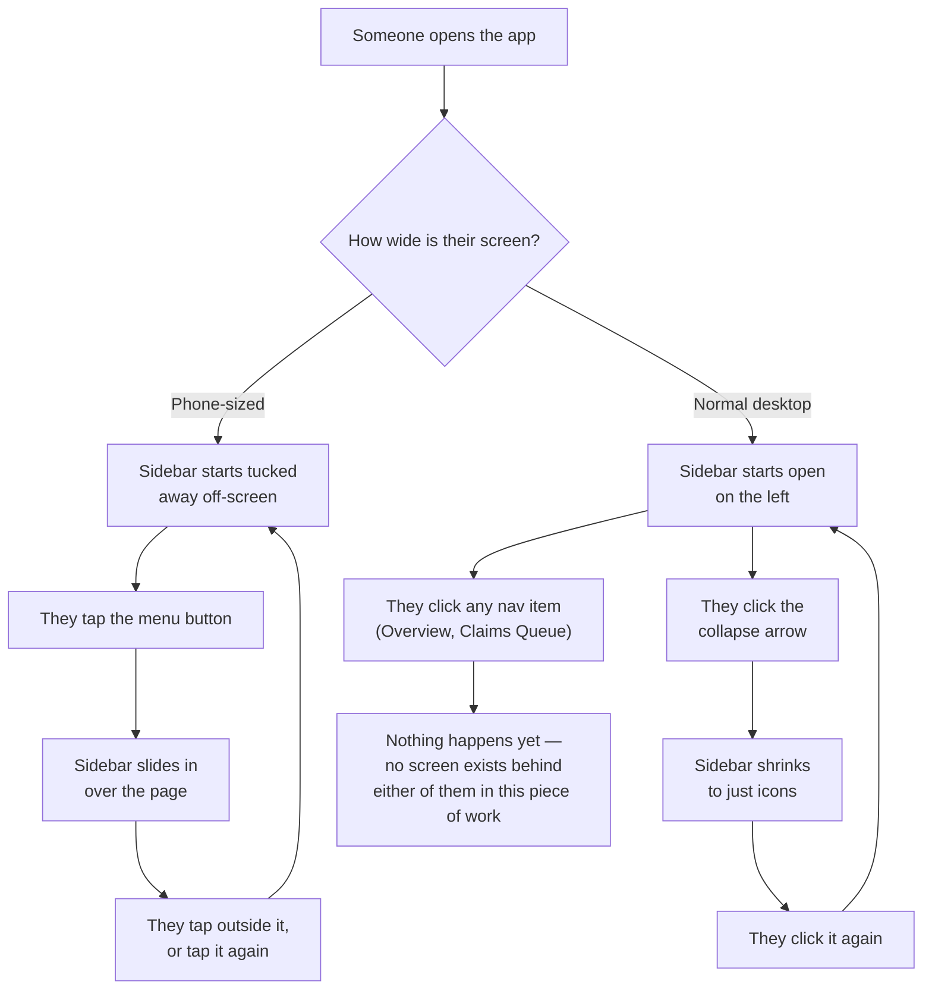

# Scaffold Fidelis Portal app shell

## Overview

**What:**
Fidelis Agent Assurance gets the permanent navigation shell of its own real application — the sidebar and layout every future screen will sit inside — instead of a shareable prototype link.

**Why:**
Everything Fidelis-side currently lives only as a prototype link, which cannot itself be the submitted product. The shell is the one piece every other Fidelis screen depends on, so it comes first and stays deliberately minimal — no screen content yet.

**How:**
Stand up the application with its navigation shell — sidebar, nav items, footer — matching the already-approved prototype and design spec exactly. The main content area is a bare placeholder; Overview and Claims Queue are separate, later pieces of work.

**Zone 1 check:**
Advances **Implementation** — a design already approved (published prototype + `DESIGN.fidelis.md`) is cheap to verify against here because the target output is fully specified in advance, not discovered during the work.

---

## Core Logic



### Business rules

- On a phone-sized screen the sidebar always starts hidden; on a normal-sized screen it always starts open. This depends only on how wide the screen is, not on anything the person did last time.
- Collapsing to icons-only is a desktop-only move — on a phone the sidebar is all-or-nothing (a slide-in panel), never a collapsed icon rail.
- No nav item goes anywhere yet — this issue is the shell only. Both items render so the sidebar looks complete, but neither is wired to a real screen.
- The footer shows the reserve pool balance as static display text — no live data source exists yet in this piece of work.

This is pure UI — a navigation shell with no data, no branching, and nothing worth testing. Verification is visual parity against the published prototype plus a clean build.

---

## File Tree

```
apps/fidelis/
├── package.json                     # new — Vite + React 19 + TS + Tailwind v4, mirrors tools/journey-tracker's dependency set
├── vite.config.ts                   # new — mirrors tools/journey-tracker's Vite + Tailwind plugin config
├── tsconfig.json                    # new — mirrors tools/journey-tracker's TS config
├── index.html                       # new — Vite entry; loads Plus Jakarta Sans + JetBrains Mono
├── src/main.tsx                     # new — React root mount
├── src/App.tsx                      # new — renders AppSidebar + a bare placeholder main area
├── src/index.css                    # new — Tailwind v4 theme block, recolored from tools/journey-tracker's per DESIGN.fidelis.md
├── src/lib/utils.ts                 # copied verbatim from tools/journey-tracker (cn helper) — zero review cost
├── src/hooks/useIsMobile.ts         # copied verbatim from tools/journey-tracker — zero review cost
├── src/components/ui/button.tsx     # copied verbatim from tools/journey-tracker — zero review cost
├── src/components/ui/separator.tsx  # copied verbatim from tools/journey-tracker — zero review cost
├── src/components/ui/sheet.tsx      # copied verbatim from tools/journey-tracker (sidebar's mobile drawer) — zero review cost
├── src/components/ui/sidebar.tsx    # copied verbatim from tools/journey-tracker (real shadcn sidebar primitive) — zero review cost
├── src/components/ui/input.tsx      # copied verbatim from tools/journey-tracker — sidebar.tsx's hard dependency (SidebarInput), not portable without it
├── src/components/ui/skeleton.tsx   # copied verbatim from tools/journey-tracker — sidebar.tsx's hard dependency (SidebarMenuSkeleton), not portable without it
└── src/components/AppSidebar.tsx    # new — Fidelis nav (Overview/Claims Queue, all inert) + Reserve pool footer
```

---

## Action Items

**[x] Scaffold the Vite + React + TypeScript + Tailwind v4 project**

Implement: `apps/fidelis/package.json`, `vite.config.ts`, `tsconfig.json`, `index.html` mirroring `tools/journey-tracker`'s proven config, adapted for the `apps/fidelis` package.

Verify:
```
cd apps/fidelis && npm install && npm run build
```
→ exits 0

**[x] Port journey-tracker's shadcn UI primitives unmodified**

Implement: copy `src/lib/utils.ts`, `src/hooks/useIsMobile.ts`, `src/components/ui/button.tsx`, `separator.tsx`, `sheet.tsx`, `sidebar.tsx` verbatim from `tools/journey-tracker`. `sidebar.tsx` imports `Input` and `Skeleton` (`./input`, `./skeleton`) as hard dependencies not listed in the original plan — ported those two verbatim as well; without them `sidebar.tsx` cannot be kept unmodified.

Verify:
```
diff tools/journey-tracker/src/components/ui/sidebar.tsx apps/fidelis/src/components/ui/sidebar.tsx
```
→ no output (files identical) — confirmed, plus `input.tsx` and `skeleton.tsx` diffed identical too

**[x] Apply Fidelis's garnet theme tokens**

Implement: `apps/fidelis/src/index.css` — Tailwind v4 theme block using `DESIGN.fidelis.md`'s light/dark color values in place of `tools/journey-tracker`'s own teal, plus the Plus Jakarta Sans and JetBrains Mono font declarations.

Verify:
```
grep -q "8B3A46" apps/fidelis/src/index.css && echo FOUND
```
→ `FOUND`

**[x] Build AppSidebar with Fidelis's nav and Reserve pool footer**

Implement: `src/components/AppSidebar.tsx`, composed from the ported sidebar primitives, pinned to the published prototype's exact structure ([artifact ac20cb4d-f92e-4559-aa01-55ac8cec4921](https://claude.ai/code/artifact/ac20cb4d-f92e-4559-aa01-55ac8cec4921)):
- header block — shield icon in a rounded badge, "Fidelis" title, "Agent Assurance · Insurer" subtitle underneath
- nav list — "Overview" (grid icon) and "Claims Queue" (inbox icon, trailing item-count badge), both inert
- footer block — "Reserve pool" label above the dollar-formatted balance, no icon

Verify:
```
cd apps/fidelis && npx tsc --noEmit
```
→ exits 0

**[x] Wire the shell into a running app**

Implement: `src/App.tsx` rendering `AppSidebar` plus a bare placeholder main area, `src/main.tsx` entry point.

Verify:
```
cd apps/fidelis && npm run build
```
→ exits 0
