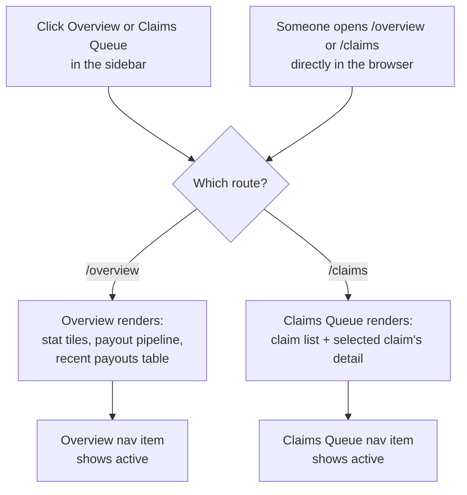
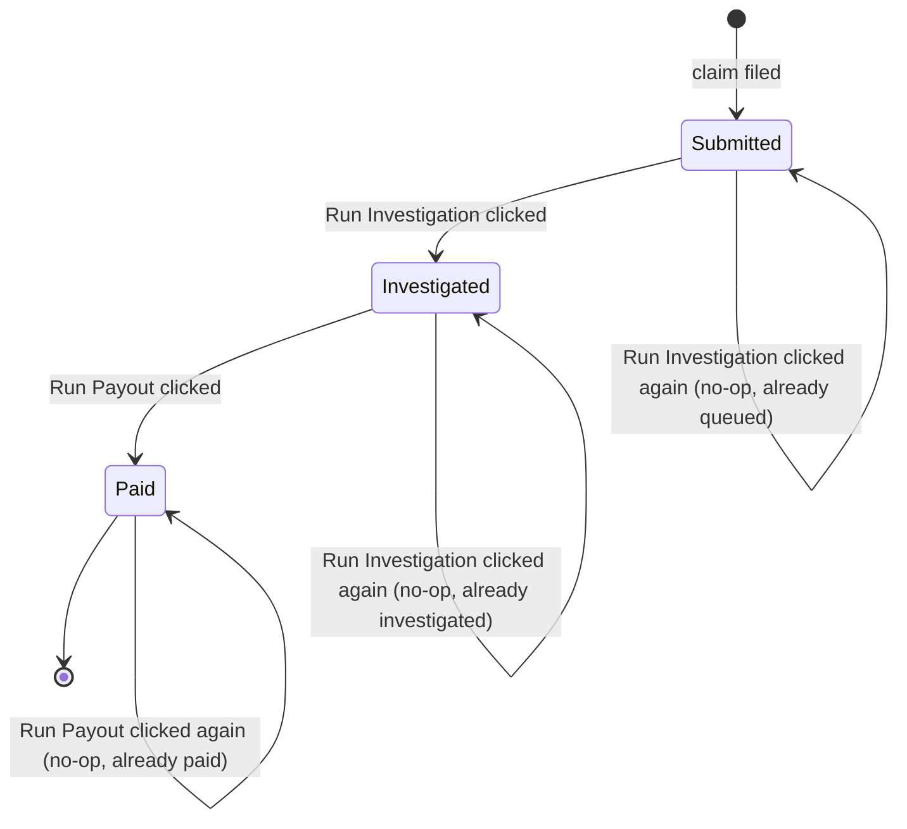

# Scaffold Fidelis Portal app shell

## Overview

**What:**
Fidelis Agent Assurance gets its own real, running application with both of its working screens reachable by URL — Overview (pool health and how a claim gets paid) and Claims Queue (investigate and pay a disputed claim) — not just a navigation frame.

**Why:**
A shell with no screens behind it can't demonstrate the actual claims workflow, and everything Fidelis-side still only exists as a shareable prototype link, which can't itself be the submitted product. Matching the approved prototype's full behavior — not just its layout — is what makes this a real product instead of a static frame.

**How:**
Give Overview and Claims Queue their own routes so each is a real, directly-loadable screen, and port the prototype's claim data and its two actions — investigate a claim, then pay it — into the running app. The outcome of each action matches the approved prototype exactly (a verdict appears, a payout debits the pool); the prototype's cosmetic step-by-step reveal timing is dropped since it doesn't change what's being verified.

**Zone 1 check:**
Advances **Implementation** — a design already approved (published prototype + `DESIGN.fidelis.md`) is cheap to verify against here because the target output — both screens' layout and the claim lifecycle they drive — is fully specified in advance, not discovered during the work.

---

## Core Logic





### Business rules

- Visiting `/overview` or `/claims` directly renders that screen — these are real routes, not just internal tab state.
- The sidebar highlights whichever nav item matches the current route.
- A claim can only be investigated once; running it again on an already-investigated claim changes nothing.
- Run Payout is unavailable until a claim is investigated, and running it again on an already-paid claim changes nothing.
- Paying a claim deducts its amount from the pool balance exactly once, at the moment of payout.
- The sidebar's Claims Queue badge, the sidebar footer's pool balance, and Overview's stat tiles are always derived from current claims/pool state — never a separately-stored copy.

---

## File Tree

```
apps/fidelis/
├── package.json                          # modify — add react-router-dom (routing) and vitest (unit tests); vitest runs on its defaults, no vite.config.ts change needed
├── src/index.css                         # modify — add success/warning color tokens to @theme (needed for status badges on Claims Queue and the recent-payouts table)
├── src/lib/claims/types.ts               # new — Claim type
├── src/lib/claims/data.ts                # new — seed claims + initial pool balance, mirrors the approved prototype's seed state
├── src/lib/claims/stats.ts               # new — computeClaimStats, getRecentPayouts (pure, derived from claims)
├── src/lib/claims/transitions.ts         # new — investigateClaim, payClaim (pure state transitions, no-op guarded)
├── src/lib/claims/__tests__/stats.test.ts        # new
├── src/lib/claims/__tests__/transitions.test.ts  # new
├── src/App.tsx                           # modify — BrowserRouter + routes for /overview and /claims; owns claims + pool balance state
├── src/components/AppSidebar.tsx         # modify — nav items become real route links with active-route highlighting; badge + footer read live state
├── src/components/StatTile.tsx           # new — reusable stat card used by Overview
├── src/routes/Overview.tsx               # new — stat tiles, payout pipeline, recent payouts table
└── src/routes/ClaimsQueue.tsx            # new — claim list + selected claim's investigate/payout detail panel
```

---

## Action Items

**[x] Add routing and wire it into the shell**

Implement: `apps/fidelis/package.json` (add `react-router-dom`), `src/App.tsx` (`BrowserRouter`, routes for `/overview` and `/claims`, `/` redirects to `/overview`), `src/components/AppSidebar.tsx` (nav items become route links; the item matching the current route is marked active).

Verify:
```
cd apps/fidelis && npx tsc --noEmit
```
→ exits 0

**[x] Add claims data and pure claim business logic — [unit]**

Implement: `src/lib/claims/types.ts`, `data.ts` (seed data mirroring the approved prototype: two claims, $48,800 pool balance), `stats.ts` (`computeClaimStats`, `getRecentPayouts`), `transitions.ts` (`investigateClaim`, `payClaim` — each a pure, no-op-guarded state transition per the Core Logic state diagram).

Verify:
```
cd apps/fidelis && npx vitest run
```
→ exits 0, all tests pass

**[x] Wire claims state into the app shell**

Implement: `src/App.tsx` — `useState` for claims and pool balance seeded from `src/lib/claims/data.ts`, handlers calling `investigateClaim`/`payClaim` and updating state, passed down to `AppSidebar` (badge count, footer balance) and both route screens.

Verify:
```
cd apps/fidelis && npx tsc --noEmit
```
→ exits 0

**[x] Build the Overview screen**

Implement: `src/routes/Overview.tsx` + `src/components/StatTile.tsx` — four stat tiles (reserve pool, claims filed, claims paid, active policies), the prototype's static "how a claim gets paid" pipeline, and a recent-payouts table driven by `getRecentPayouts`, matching the published prototype's layout ([artifact ac20cb4d-f92e-4559-aa01-55ac8cec4921](https://claude.ai/code/artifact/ac20cb4d-f92e-4559-aa01-55ac8cec4921)).

Verify:
```
cd apps/fidelis && npx tsc --noEmit
```
→ exits 0

**[x] Build the Claims Queue screen**

Implement: `src/routes/ClaimsQueue.tsx` — claim list (left) and the selected claim's detail panel (right) with Run Investigation / Run Payout buttons wired to the handlers from `App.tsx`, matching the published prototype's layout and button disabled-states.

Verify:
```
cd apps/fidelis && npx tsc --noEmit && npm run build
```
→ both exit 0

---

## Revision — primary accent color

During Phase 3 review, the human asked for the primary accent to move off the original deep-garnet red — it read as an alert/warning color rather than an institutional brand color. `DESIGN.fidelis.md` and `apps/fidelis/src/index.css` were both updated to a deep plum (`#5B3A78` light / `#B79BD6` dark) in place of garnet (`#8B3A46` light / `#C96B78` dark); everything else about the design system (Airbnb-style rounding, Plus Jakarta Sans/JetBrains Mono, sponsor-tag colors) is unchanged.
