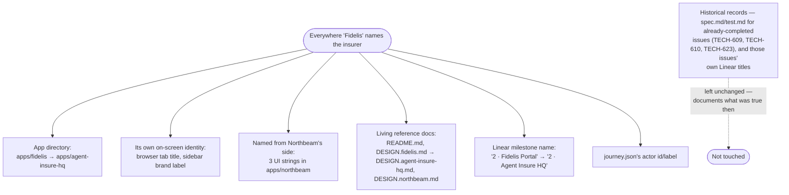

# Rebrand Fidelis Portal to Agent Insure HQ

## Overview

**What:**
Every place the insurance company in this story is called "Fidelis" becomes "Agent Insure" instead — its staff portal, its own on-screen branding, and the two places Northbeam's own portal names it back.

**Why:**
Agent Insure isn't only this project's own name — in the story, it's meant to be the actual insurance company. Northbeam is its customer. "Fidelis" was a separate placeholder name chosen before that was settled, and it now contradicts the pitch rather than supporting it.

**How:**
The insurer's staff portal, its own in-app identity, and every place it's named from the customer's (Northbeam's) side all get updated to say "Agent Insure" — a pure rename with no behavior change. Historical records of already-completed work (past specs, past Linear issue titles) are left exactly as they were, since they document what was true when they were written, not what's true now.

**Zone 1 check:**
Design. This isn't new capability — it corrects a naming decision made before the pitch narrative was settled, so the product and its own submission no longer talk about two different insurance companies.

---

## Core Logic



### Business rules

- Every rename is text/path-only — no logic, no new behavior, nothing that changes what the app does, only what it's called.
- A past issue's own spec.md, test.md, and Linear title are never edited by a later issue — they're a permanent record of what was true when that issue was built, not a live description of the current name.
- `.claude/` skill files are never touched by this issue's Action Items, even where they use "fidelis" as an illustrative example name in their own prose — that's a skill-maintenance change, not part of this rename.

---

## File Tree

```
apps/
  fidelis/ → agent-insure-hq/        # renamed directory (git mv) — 27 files, content unchanged except:
    package.json                      # modified — "name": "agent-insure-fidelis" → "agent-insure-hq"
    package-lock.json                 # modified — same, regenerated
    index.html                        # modified — <title>Fidelis Portal</title> → Agent Insure HQ
    src/components/AppSidebar.tsx     # modified — sidebar brand label "Fidelis" → "Agent Insure"; comment referencing spec TECH-623 path stays (historical)
  northbeam/
    src/components/DemoBar.tsx        # modified — "Fidelis Agent Assurance" → "Agent Insure" in the resolution message
    src/pages/Claims.tsx              # modified — same, in the claim-status line
    src/pages/Overview.tsx            # modified — same, in the Hedera stat-tile description
    src/components/ui/badge.tsx       # modified — comment only, "shared with Fidelis" → "shared with Agent Insure HQ"
    src/index.css                     # modified — comment only, same
    src/lib/store.ts                  # modified — comment only, same
server/
  src/index.js                       # modified — comment only, "Northbeam and Fidelis" → "Northbeam and Agent Insure HQ"
.env.example                          # modified — comment only, "apps/northbeam or apps/fidelis" → "apps/northbeam or apps/agent-insure-hq"
DESIGN.fidelis.md → DESIGN.agent-insure-hq.md   # renamed + content updated (frontmatter name, prose)
README.md                             # modified — pitch/architecture prose + Mermaid node IDs
DESIGN.northbeam.md                   # modified — 3 references
```

---

## Action Items

**[x] Rename the app directory and its own identity**

Implement: `git mv apps/fidelis apps/agent-insure-hq`. Update `apps/agent-insure-hq/package.json` and `package-lock.json`'s `"name"` field to `"agent-insure-hq"`. Update `index.html`'s `<title>` to "Agent Insure HQ". Update `AppSidebar.tsx`'s sidebar brand label from "Fidelis" to "Agent Insure" (subtitle simplifies from "Agent Assurance · Insurer" to "Insurer" — the old subtitle is now redundant with the new main label).

Verify:
```
test -d apps/agent-insure-hq && test ! -d apps/fidelis && npm run build --prefix apps/agent-insure-hq
```
→ exits 0, no type errors

**[x] Update where Northbeam names the insurer**

Implement: In `apps/northbeam/src/components/DemoBar.tsx`, `src/pages/Claims.tsx`, and `src/pages/Overview.tsx`, replace "Fidelis Agent Assurance" with "Agent Insure" in the three user-facing strings identified in the File Tree.

Verify:
```
npm run build --prefix apps/northbeam && ! grep -ri fidelis apps/northbeam/src
```
→ exits 0, no type errors, no remaining "fidelis" text in Northbeam's source

**[x] Update comments, living docs, and the Linear milestone**

Implement: Update the six code comments listed in the File Tree (cosmetic only, no behavior). Rename `DESIGN.fidelis.md` to `DESIGN.agent-insure-hq.md` and update its prose. Update `README.md`'s pitch/architecture narrative and Mermaid node IDs. Update `DESIGN.northbeam.md`'s three references. Rename the Linear milestone "2 · Fidelis Portal — Investigate & Pay Claims" to "2 · Agent Insure HQ — Investigate & Pay Claims" via Linear MCP. Update `journey.json`'s actor id/label for this side of the story (gitignored — not part of the git diff). Leave every already-completed issue's own spec.md, test.md, and Linear title untouched.

Verify:
```
! git grep -ril fidelis -- ':!specs/agent-insure/2-fidelis-portal-investigate-pay-claims/TECH-623-scaffold-fidelis-portal-app-shell' ':!specs/agent-insure/1-northbeam-portal-operate-recover/TECH-609-wire-claim-filing-to-a-real-backend-record' ':!specs/agent-insure/1-northbeam-portal-operate-recover/TECH-610-wire-the-real-world-selfie-check-sdk-into-claim-filing' ':!.claude/skills/e2e-verify/SKILL.md'
```
→ exits 0 (no matches) — confirms nothing outside the explicitly-excluded historical specs and the skill file still says "fidelis"

**[x] Confirm nothing else broke**

Implement: No code changes — this item is the regression check for the rename above.

Verify:
```
npm run build --prefix apps/northbeam && npx vitest run --root apps/northbeam && npx playwright test --config apps/northbeam/playwright.config.ts --reporter=list
```
→ build and unit tests exit 0; `claim-filing.spec.ts` and `selfie-check.spec.ts` pass (3/3); `lock-rules.spec.ts` skips (this worktree has no `SEPOLIA_PRIVATE_KEY` — expected, not a failure) rather than asserting anything affected by the rename

---

## Proven — visually, in both running apps

All four Action Items verified. Beyond the grep/build/test checks above, both apps were actually run and screenshotted: Agent Insure HQ's own sidebar and browser tab read "Agent Insure / INSURER" (not Fidelis), and Northbeam's Overview page — one of the three places that names the insurer from the customer's side — correctly reads "...the reserve pool the payout is drawn from at Agent Insure."

One pre-existing issue noticed but out of scope here: `apps/hq/package.json`'s dev/preview scripts hardcode port 6323, the same port the business app's dev server uses — a collision that predates this rename. Not touched, since it's not something this spec's Action Items named.

---

## Further refined, before PR — app directories renamed generically by role

The Action Items above describe (and were verified against) the first pass: `apps/fidelis` → `apps/agent-insure-hq`. Continued conversation with the human, still before this PR opened, landed on a sharper principle: a brand name is demo *data* ("Northbeam Distributors" and "Agent Insure" are both just today's one hardcoded company per side — neither app is actually multi-tenant), not the identity of the app itself. Applied consistently to both sides:

- `apps/agent-insure-hq` → **`apps/hq`** (package name `hq`)
- `apps/northbeam` → **`apps/business`** (package name `business`; localStorage key `agent-insure-northbeam-v1` → `agent-insure-business-v1`; the one-time ENS registration script's own path comments updated to match)

Brand text is untouched by this second pass — the sidebar in `apps/hq` still says "Agent Insure," the business app still displays "Northbeam Distributors," `journey.json`'s actor id/name stay `northbeam`/"Northbeam Distributors," and `DESIGN.northbeam.md` keeps its filename (it documents that specific brand's visual identity, not the app's code structure). Only the directory names, package names, and the one internal storage key changed.

Re-verified after this second pass: `apps/hq` builds; `apps/business` builds, its 12 unit tests pass, and all three e2e suites pass (`claim-filing`, `selfie-check` for real; `lock-rules` skips in this worktree — no `SEPOLIA_PRIVATE_KEY` here, same as before, not a regression).
